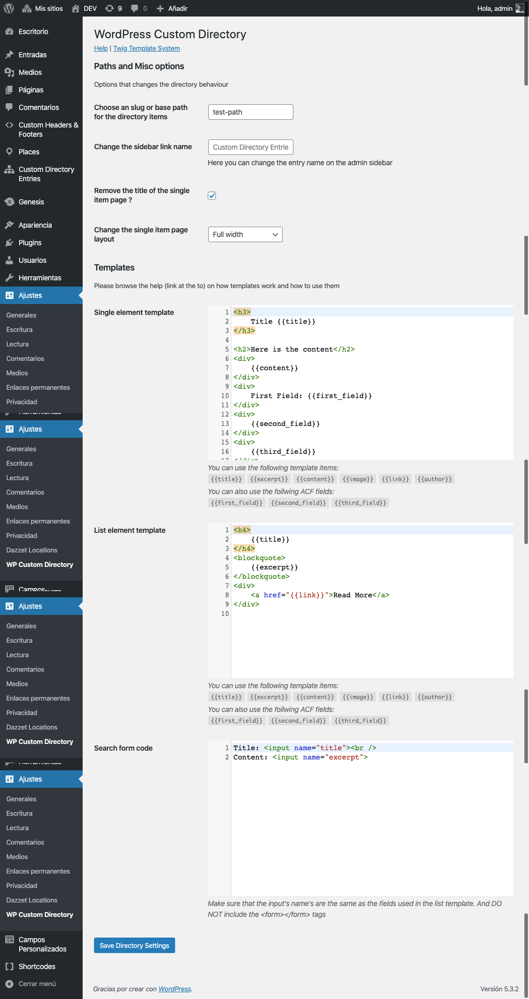

This plugin I did it as a personal project.

The **Wordpress Custom Directory plugin**, allows a webmaster or editor to create a searchable list of items in any page or any blog post. Additionally, each item will have its own page with its own url.

Items in the list can be Personnel Profiles, Product Information (although WooCommerce would be better for that use case), Catalog Information, etc.

The main features of the plugin are:

- Allows the user to create a list of items that can be embedded in any page or post using one Shortcode.
- Is possible to add a custom form on top of the list of items so you can filter the items using a basic LiveSearch.
- Templates are used to modify how how the list items are displayed and what information will be included in the list.
- Every directory item has its own URL which make it SEO friendly.
- A template is used to modify how the individual items are displayed.
- Both templates use the Twig template language to specify what to include in the items or in the list. (The Twig template system is very similar to Shopify's Liquid).
- Is possible to specify how the search on the list items will work or by which fields the search will be made.
- The directory items are WordPress post types, so its possible to use plugins like ACF to add fields to the items. Or use WordPress filters to modify what information will be in every item.
- The _base path_ for the directory items can be configured.
- Its possible to create more than one directory by using taxonomy terms.

## Used Technologies

Since this is a WordPress plugin, a great deal of technologies where required:

For the development environment I used a [Vagrant Machine](https://www.vagrantup.com/) with [Ubuntu](https://ubuntu.com/) 18.04 installed inside of it.

Also, I used a pre-created script to install [WordPress](https://wordpress.org) using [WP-CLI](https://wp-cli.org/) from the command line. This script installs Wordpress and a short list of required plugins like [ACF](https://www.advancedcustomfields.com/), [Code Snippets](https://wordpress.org/plugins/code-snippets/) and a basic template.

Just to be sure the the plugin will work on secured environments, I used _Lets Encrypt_ [certbot](https://certbot.eff.org/) to create a SSL cert on the vagrant machine. I still received the _Not Secured_ warning, but I could work with SSL.

I also used serveral [packagist](https://packagist.org/) packages for installing external libraries. Specifically I used [Twig](https://packagist.org/packages/twig/twig) for templates and [PHP Markdown](https://github.com/michelf/php-markdown) for creating inline help using Markdown.

Finally, I configured [Visual Studio Code](https://code.visualstudio.com) to use [PHP Sniffer](https://marketplace.visualstudio.com/items?itemName=wongjn.php-sniffer) for code sniffing and beautification. I actually have a [blog post](/posts/phpcodesniffer-vscode-wordpress-config/) explaining how to do that configuration.

## How it works

The plugin creates a [custom post type](https://developer.wordpress.org/plugins/post-types/) for storing the items that will be displayed on a list.

To display a filtrable list (the _Live Search_ list) you need to use 2 _shortcodes_:

2. A shortcode for embedding a _Live Search_ form on a page.
1. A shortcode for embedding a list of items on a page

The requirement is that both shortocodes have to be on the same page since the search works by showing/hiding items o the list using vanilla JavaScript.

To change how the items on the list are displayed, there is a _Settings Page_ that allows you to create a template for the search form, the list items and how each item will be displayed on its own.

## Screenshots

This are some screenshots that show different parts of the plugin

### Configuration screen

### Embedded Help

### Directory Sample

## Live coding sessions

Here are the live coding sessions for the creation of the plugin.

_This is for demonstration purposes only, there is no sound or explanation of the process._

<iframe width="560" height="315" src="https://www.youtube.com/embed/videoseries?list=PLqJrOd2CQU3cx-DUq0fPpFyYpLJYkwTba" frameborder="0" allow="accelerometer; autoplay; encrypted-media; gyroscope; picture-in-picture" allowfullscreen></iframe>

