# Install and Manage PostgreSQL in a Mac with Homebrew

In this post I'll show you how to install [PostgreSQL](https://postgresql.org) on a Mac machine, as easy as possible, using [Homebrew](https://brew.sh). And I'll also show you some tips, tricks and gotchas.

As I bonus, I'll show you how to access it directly in visual studio since most of the visualization tools are commercial or pretty cumbersome to use.

## TOC

```toc
from-heading: 2
to-heading: 3
```

## Install the package

This is very straight forward, specially if you have used Hombrew before:

```bash
brew doctor
brew update
brew install postgresql
export PGDATA='/usr/local/var/postgres' #check your package dir
```


One word about that last step, the `export` step.

That's a warning that the PostgreSQL installer issues: To export the `PGDATA` variable in case the command `psql` doesn't work.

In my case I didn't have to use it, but its a good idea to keep that in mind.

To verify that all whent well. Lest list the installed services and look for `postgresql`


## Disable service auto start

If you don't want/need a background service started at boot time, you can just run:

```bash
pg_ctl -D /usr/local/var/postgres start
```

In that way you have to manage the start/stop of the service by your self.

On a Mac, a PostgreSQL server without connections do not consume a lot of resources so its pretty safe to have the service start automatically at boot time.

## Service management.

The advantage of using Homebrew is that we can use the `brew` command to manage the service as opposed of the more traditional `lanchctl` command that Mac OS uses.

So to start the service, just type:

```bash
brew services start postgresql
```


And to stop it...

```bash
brew services stop postgresql
```

## Common errors

This are a couple of solutions to common errors

### You do not have any databases

After install you should be able to list the databases from the command line:

```bash
psql -l
```


But it possible that you get an error saying that you do not own any database. The solution would be to create your own database:

```bash
createdb `whoami`
```

### Postgres role not present

Also, if you are getting an error about the `postgres` role not being present, then create the _PostgreSQL User_ `postgres`.

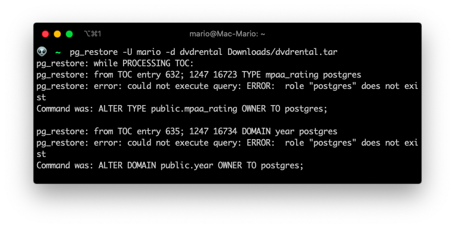

```bash
createuser -s postgres
```

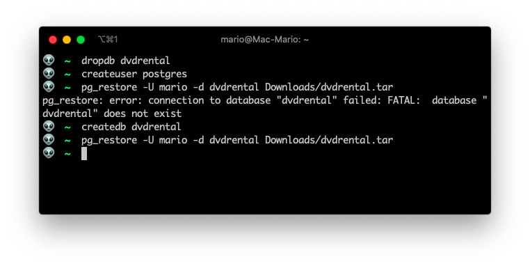

## PgAdmin

The most complete tool for managing your databases is [PgAdmin](https://www.pgadmin.org/)

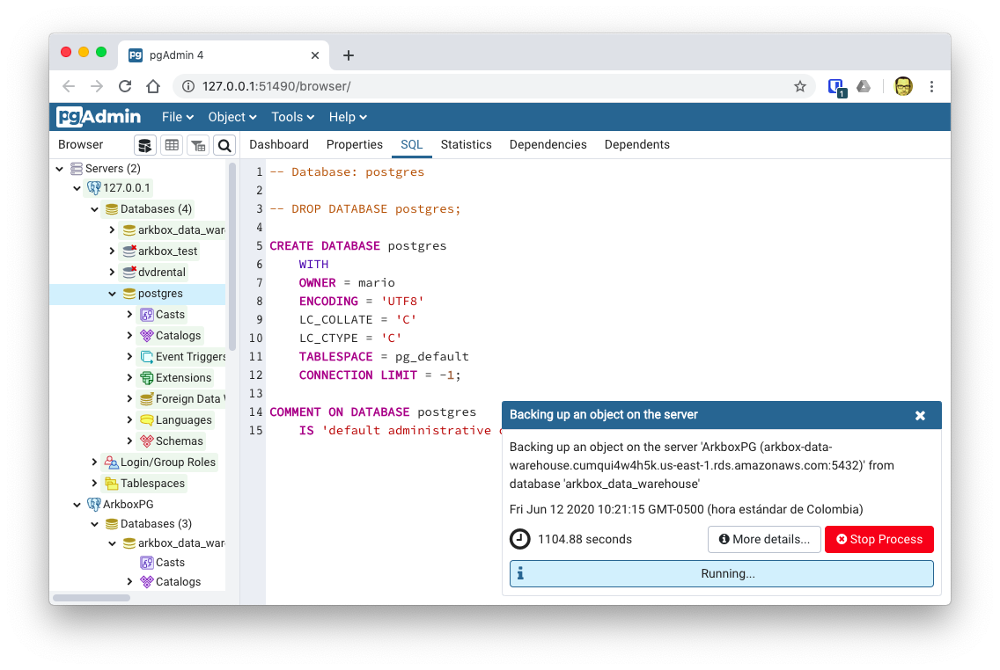

As you can see it run in a browser window.

To install it just issue

```bash
brew install pgadmin4
```

I recommend this tool in 2 use cases:

- Backup a database
- Upload text files to a table

Even tough you can do queries with this tool, I recommend using _Visual Studio Code_ plugins for that.

### Restore a database

If you want to create a local development database from a production database, the best option (or at least the fastest) its to create a local db from a backup of production.

If you followed the previous section, you might have an `.sql` file with the backup.

So in order to restore that database, you first have to create a new one in your local machine:

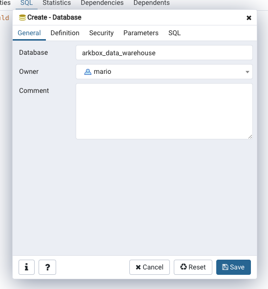

Then you have to start the import by selecting the backup file. and click on `Restore`.

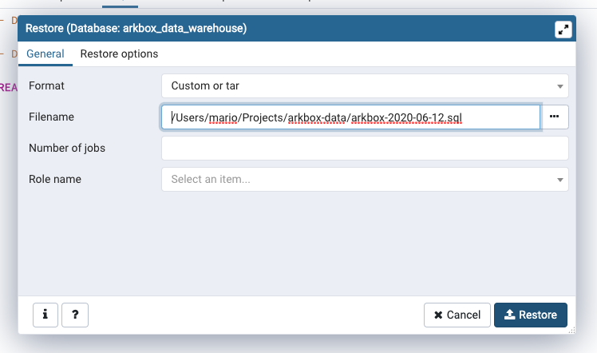

One important thing to notice. **The restoration process shows warnings as errors**.

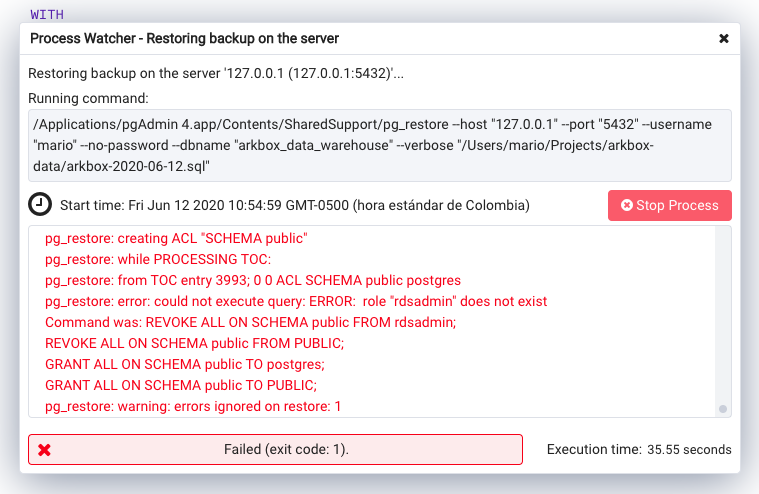

In this case, I have a warning about a `role` not beingh present. But the database did import correctly.

### Import a `csv` file in a table

If you have a text file (`csv` or `tsv`) you can import it directly to a table using _PgAdmin_

Just **right click on the table you want to import it to, and select `import`**. You'll get the following dialog:

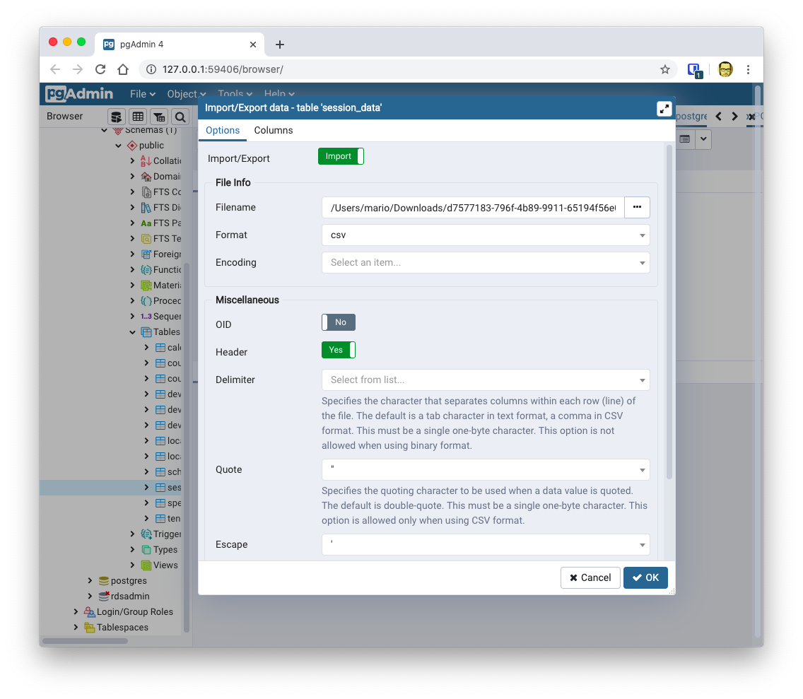

Here yo have to specify

- Which file you want to import
- If the first row are the column titles (`Header` option)
- How is the data quote (by `"` or by `'`)
- If there is a keyword for empty values (By default is `\N`)

By going to the `Columns` tab on that same dialog, you can select **the order** in which the fields are on the `csv` file.

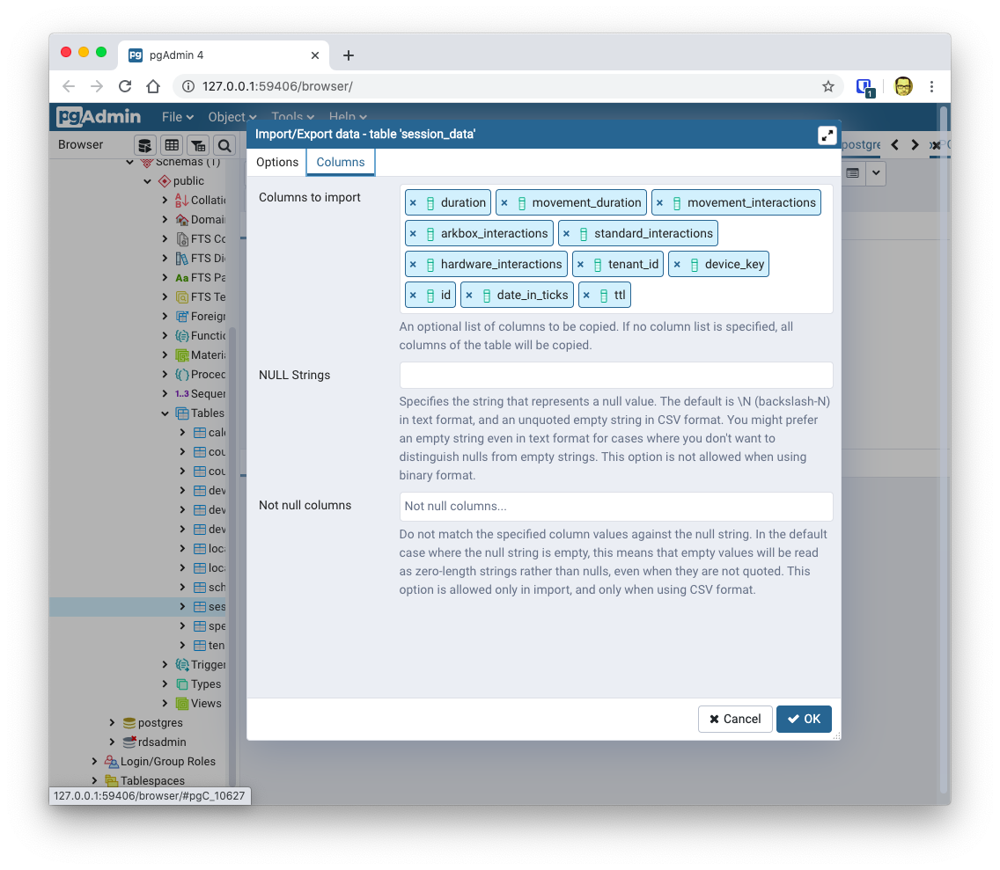

And finally, verify how many records got imported


## Visual Studio Code Extensions

There are several extensions that you can use to connect to PostgreSQL using visual studio code. There is even one created by Microsoft...

There are 2 that I recommend:

- [PostgreSQL](https://marketplace.visualstudio.com/items?itemName=ckolkman.vscode-postgres) by Chris Kolkman which is great but only works on _PostgreSQL_
- [SQLTools - Database tools](https://vscode-sqltools.mteixeira.dev/) from Matheus Teixeira which is even better and it actually manages several databases.

You can install either one using the extension manager inside _Visual Studio Code_. Or you can install it from the terminal with the following commands:

```bash
# PostgreSQL
code --install-extension ckolkman.vscode-postgres

# SQLTools
code --install-extension mtxr.sqltools
```

### PostgreSQL Extension

Before we get into creating a connection, let me give you the most practical tip about this extension: **Use `F5` to execute a query** 😅


#### Setup and connect

Just create a connection


Or if you already have a connection, just select one:


#### Explorer

If you have objects on your database, you can use the explorer to view them:


### SQLTools Extension

This one is a little more straight forward to use. And again... The most practical tip I can give you with this extension is that you can execute a query **by selecting a query** and then executing `⌘E⌘E` (CMD-E twice).

#### Create a connection

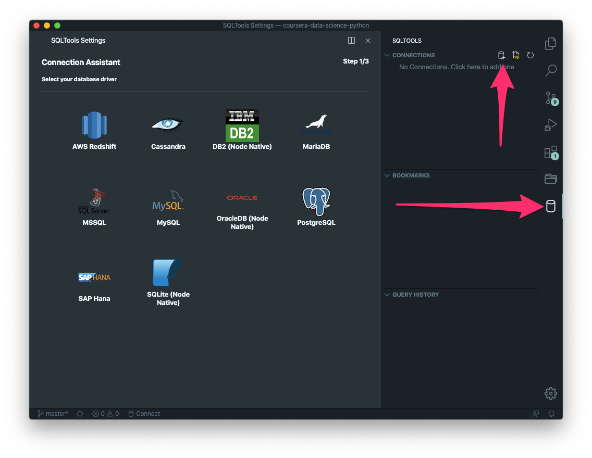

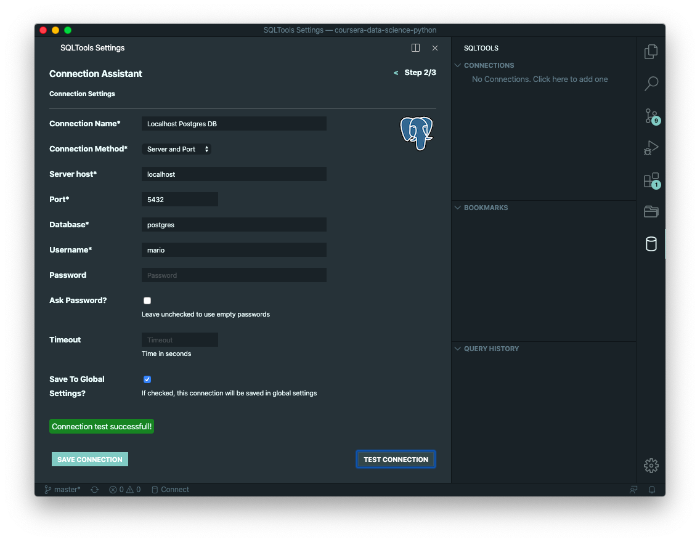

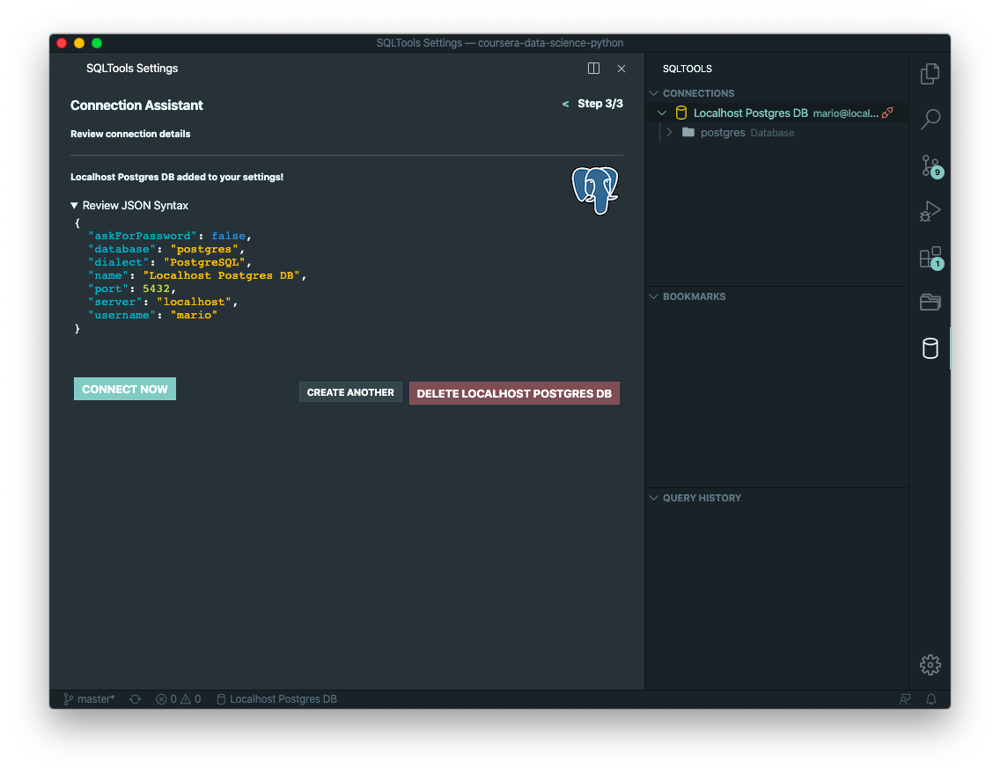

#### Execute a query


## Remove completely PostgresSQL

If your done with your development or if you are receiving error with your PostgreSQL service, then you might need to delete and re-install your PostgreSQL.

The problem lies with the fact that most of the time re-installing doesn't solve the problem.

In that case you have to **completely delete** the package and the database files.

```bash
brew uninstall postgresql
rm -rf /usr/local/var/postgres
rm ~/.psql*
rm ~/.pgpass
```
