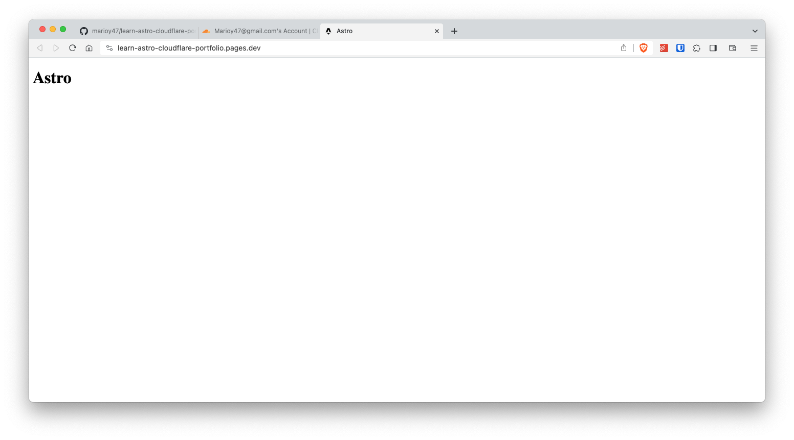

# Creating a simple site with Astro and publish it to CloudFlare Pages

If you look at the [first post](webpack-wordpress-config/) in this site, you'll notice that I used to use [GatsbyJS](https://gatsbyjs.com) for publishing this blog, and that worked fine for a while. But some issues started to arise:

- Upgrading packages started to become difficult
- I ran into deprecations of _Gatsby Packages_
- Most of the improvements I wanted to apply required me to use _Gatsby specific_ plugins
- I had to use multiple configuration files and the main configuration file started to get too big
- The time from writing to actually seen the publish page was very long
- Having to use GraphQL to do simple tasks like get a list of files was less than ideal
- I had to use _Gatsby Specific_ components to do things like adding a link (`<Link src...>`) on a page

So after 4 years, it was time to switch technologies and republish my blog, but there was one big caveat, it should be a static blog generator with support to [Markdown](https://www.markdownguide.org/).

The first thing I tested out was site builders like [Jekyll](https://jekyllrb.com/) and [Hugo](https://gohugo.io/), which are great, but they still need intermediate steps when I want to publish my information to a basic Web Server.

Luckily, while looking into publishing tools, I ran into [Astro](https://astro.build/) and I fell in love with how straight forward it is and specially how fast the build step runs.

Here are some notes on the things I learned while reading upon Astro

## TOC

## But What is Astro

I'm just going to say here that _Astro is an **all-in-one** **web framework** for building **fast,** **content-focused** websites._ (taken from the official site)

If you really want to learn Astro, you should really look into it's [documentation](https://docs.astro.build/en/getting-started/). Is very clear and basic, but also very thorough..., and kind of long.

That's it.

## Astro Setup

Setup could not be easier just an `npm create` command and your off to the races.

```bash
npm create astro@latest learn-astro-cloudflare-portfolio
cd learn-astro-cloudflare-portfolio
echo "# Astro Portfolio site published in Cloudflare" > README.md
npm install
git init
git branch -M main
git add .
git commit -m "Project init"
```

The first cool thing you'll encounter is the guided setup that Astro offers:


Things to note regarding setting up a new project.

- If you omit the path of the project, Astro will ask you for it.
- The path has to be an **empty** or a **non existing** folder
- TypeScript with the _strict_ option is recommended, but not required

After you finish the setup, this is the file structure you'll end up with:

```bash
$ tree -I node_modules
.
├── README.md
├── astro.config.mjs
├── package-lock.json
├── package.json
├── public
│   └── favicon.svg
├── src
│   ├── env.d.ts
│   └── pages
│       └── index.astro
└── tsconfig.json

4 directories, 8 files
```

If you are in a hurry, you can `create` the site using a template and pass all answers:

```bash
npm create astro@latest my-new-blog -- --template blog --no-install --no-git --typescript strict
```

> The `--` is to pass options to `astro` and not to `npm`

## Starting Development

After you install Astro, you can just execute the `dev` command to get a _Live Reload_ development environment

```bash
npm run dev
```


And then, you can visit <http://localhost:4321> to see a live preview of your site:


You can also build your site (convert it to plain html and CSS) by executing the `build` command:

```bash
npm run build
```

And look at the results in the `dist/` folder.

## Publish to CloudFlare

By default, Astro is a site builder. This means that when you "build" your project you'll get a bunch of HTML and CSS that can be pushed to regular Http server. And that's what [CloudFlare Pages](https://pages.cloudflare.com/) offers (well in reality a little more but that's what we need right now), a place where you can publish a basic website **right from GitHub**.

One cool thing about CloudFlare Pages is that is going to take care of pulling your **Astro code** from GitHub, convert it (build) to HTML and then publish it. With Astro, the time between pushing your site to the cloud and actually being able to see it live is measured in seconds instead of minutes like other solutions.

Our first victory then, would be publishing this repo to CloudFlare pages and see it go live in like 10 seconds.

But first, we need a GitHub repository to push the code to the cloud.

### Create a GitHub Repo

The first step would be to create a repo on [GitHub](https://github.com/new) and sync our local files with it


```bash
git remote add origin git@github.com:marioy47/learn-astro-cloudflare-blog.git
git branch --set-upstream-to=origin/main main
```

### Create a CloudFlare "pages" Project and Connect it to GitHub

The second step is to create a new _Pages_ project in CloudFlare and connected to the repo we just created:

- Access [CloudFlare's dashboard](https://dash.cloudflare.com/)
- Go to **Workers & Pages**
- Select **Pages > Connect to Git**
- Select **Connect to GitHub**


CloudFlare pages will redirect you to GitHub for authentication. In GitHub select to give access just to the repo we just created and then select the repo from the drop down (in our case I just started typing `astro` to get the repo).


The GitHub will redirect you back to CloudFlare where you have to select the repo you just created, which branch will be deployed (in our case `main`) and the **build command**.


Fortunately, CloudFlare is aware of Astro so instead of typing the _build_ command, you only have to select from the drop-down _Astro_, and the _build command_ will be entered for you.


And when you click _Save and Deploy_ CloudFlare will pull a copy of the repo and execute the `build` command while showing you the progress.


Also notice that it has created a new domain for your app. In this case is `https://learn-astro-cloudflare-portfolio.pages.dev`


After the **first** deployment you'll get a unique URL of your project which you can open in a browser and see the results



### CloudFlare Custom Domain and Caching

If you are also using CloudFlare to manage your domain records, which you should, you can go into the DNS settings and change the provisional domain for something more user friendly. The steps are simple:

- Go to **Account Home > Workers & Pages**
- Select the project and then **Custom domains > Setup a Domain**

Also, and highly recommended, is that you enable _Build Caching_ so the time between pushing changes to the cloud and the final publishing goes from 10-15 seconds to 1-2 seconds:

- Go to **Settings > Builds & Deployments > Enable build Cache**
- Toggle the option

### Testing a Change in a Page

Now that you have your site in CloudFlare Pages and you have your deploy process from GitHub to CloudFlare in place, pushing a change is ridiculously easy:

```bash
sed -i "" "s/>Astro/>Mario's Blog/g" src/pages/index.astro # The change
git add src
git commit -m 'doc: testing a change in the homepage'
git push
```

Two things to note:

- Builds take less than a minute (sometimes a couple of seconds)
- Building and GLOBAL deployment takes about 1 minute:


As you can see CloudFlare + Astro is a match made in heaven.
