# Develop for AWS S3, DynamoDB, RDS and API Gateway locally using Serverless

I've [already said that Serverless its taking over](/aws-lambda-deployment-with-serverless/) even tough we don't know what serverles is. And I've also said that one of the most popular AWS services is [AWS Lambda](http://aws.amazon.com/lambda).

If you don't know what _AWS Lambda_ is, I recommend you read [my article](/aws-lambda-deployment-with-serverless/) on how to setup a Lambda function where I explain on detail on what it is and why you should learn it.

But the very small summary of _AWS Lambda_ is: _AWS Lambda is a service where you can publish your Java, Go, PowerShell, Node.js, C#, Python or Ruby projects without the need of creating a Virtual Machine with the required services, since that part has already been done for you by Amazon_.

So Lambda takes away the burden of installing, configuring and tuning a bunch o services for your application. But introduces a new series of problems like **How do I develop for AWS Lambda knowing that all the services are not in my computer**.

This is specially problematic if your solution requires the usage of services like S3 and DynamoDb that are proprietary of Amazon.

Luckily the open source community, and Amazon itself, has come to the rescue by creating mockup services and alternatives that can be installed in you machine and allows you develop like you are in the AWS console.

## TOC

```toc 

```

## What are we going to do

The idea behind this tutorial is to create an skeleton project that you can use to start developing your own Lambda functions with S3, API Gateway and DynamoDb offline equivalents. And using JavaScript as your development language.

**Is important to note that the final product is not suited for deployment on AWS since I'm only focused on set up local development. But you can add directives on `serverless.yml` so you can deploy afterwards**

Also, you can modify the resulting project so it works on different languages fairly easy.

## Requirements and initial setup

In order for this to work yo should have installed

- The [brew](https://brew.sh) command if you are on a Mac
- [Node.js](https://nodejs.org) with `npm` available

The first extra requirements that you might not have aleady installed are the `aws` command, and the `serverless` command. So lets start by installing the first one using `brew`. and the second one using `npm`.

```bash
brew install awscli
npm install -g serverless
```

The first line will install the `aws` command that is required for testing `s3` uploads and the second command will make the `serverless` command _globally_ available (hence the `-g` flag).

> There are other ways to install the `aws` command by using Python's pip, but they are prone to errors and might get out of sync if you have multiple Python interpreters like I do.

## Creating the project

Right. By now we should have all the required tools installed on the computer. Now lets create a node project and then lets make it so it supports serverles.

The node project creation is achieved by issuing `npm init -y` in a terminal:

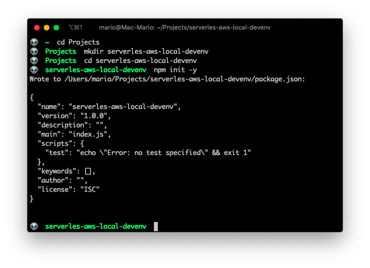

Now that we have the initial project created, lets make this a _serverless_ project with the `serverless create` command like so:

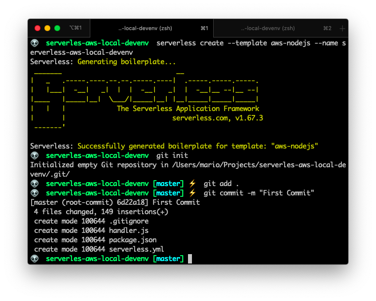

All of this can be achieved with the following commands

```bash {5}
cd Projects # Or where you store your projects
mkdir serverles-aws-local-devenv
cd serverles-aws-local-devenv
npm init -y
serverless create --template aws-nodejs --name serverless-aws-local-devenv
git init
git add .
git commit -m "First Commit"
```

And you'll end up with the following structure:

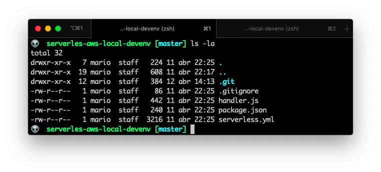

From the last screenshot you can see that `npm init` created the `pacakge.json` and `package-lock.json` files. And the `serverless create` command created the `handler.js`, `serverless.yml` and `gitignore` files.

The new command here should be the line that says

```bash
serverless create --template aws-nodejs --name serverless-aws-local-devenv
```

This instructs `serverless` to _create_ a new project that supports _node_ in _AWS Lambda_. And the project _name_ will be `serverless-aws-local`.

## Cleanup and streamline

Now I'm going to cleanup and move things around a little.

This are very personal preferences on how I develop, so you might not agree with this part, but in order to make things easier for large developments I'll do the following:

- Remove all the comments from the `serverless.yml` file
- Move the `handler.js` file to `lambdas/handler.js`

After the `serverless.yml` is cleaned up, you'll end up with:

```yaml {10}
# serverless.yml
service: serverless-aws-local-devenv

provider:
  name: aws
  runtime: nodejs12.x

functions:
  hello:
    handler: lambdas/handler.hello
```

If you look closely, you'll see that on line 10 I changed the `handler` for the function `hello` so it points to the right location.

And if I invoke **locally** the `hello` function, I should get the regular 200 response on the terminal.

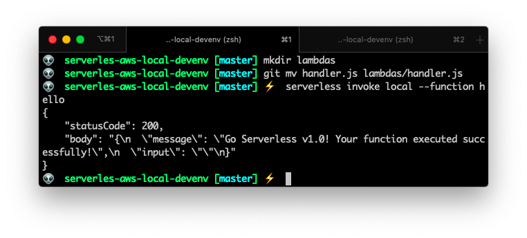

So far so good. Everything is working and we're ready to add files and configurations.

## Install the "offline" package for api calls

As I said before, I'm going to focus on the offline part of Serverless development. So lets start by adding a package that allows us to emulate the [API Gateway](https://aws.amazon.com/es/api-gateway/) but locally:

```bash
npm install serverless-offline --save-dev
```

The cool part of `serverless-offline` is that you don't have to do anything different from regular serverless development!. That is, creating a `event` and add a path.

`serverless-offline` will take care of this `events` and make local endpoints for them.

So, to make it work we need to make 2 changes:

- Create an `events` section inside our `hello` function, adding a URL path for the execution
- Create a `plugins` section and add the newly installed plugin

```yaml {11-14,16-17}
# serverless.yml
service: serverless-aws-local-devenv

provider:
  name: aws
  runtime: nodejs12.x

functions:
  hello:
    handler: lambdas/handler.hello
    events:
      - http: # Double indent the next line!
          method: get
          path: hello/{name}

plugins:
  - serverless-offline
```

Also, I changed the `lambda/handler.js` function so it recognizes the URL parameter:

```javascript {5,10}
// lambdas/handler.js
"use strict"

module.exports.hello = async event => {
  const name = event.pathParameters.name
  return {
    statusCode: 200,
    body: JSON.stringify(
      {
        message: `Hola ${name}... It works !!!`,
      },
      null,
      2
    ),
  }
}
```

This should create a local URL that responds to **get** parameters (line 12 of `serveless.yml` file) and make this url print out the name of the visitor (line 12 of `lambdas/handler.js` file).

Next, lets start the local server by executing:

```bash
serverless offline start
```

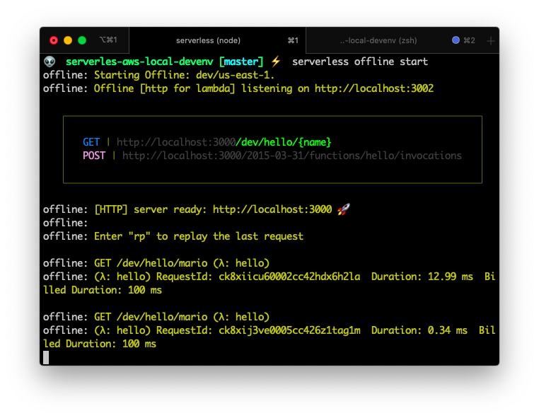

And lets test it by providing the URL `http://localhost:3000/` that is in the terminal, with the path `/dev/hello/mario yepes` and see what does it outputs.

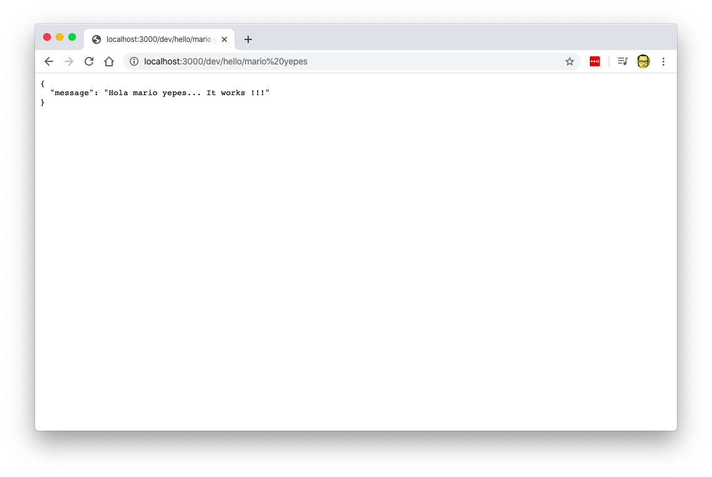

And it works!!!.

## S3 offline

Now that we've created and endpoint for our `handler.hello` function. Lets create a local s3 equivalent.

And as always, lets start by installing a new `npm` package. In this case its the `serverless-s3-local` which emulates a local S3 Bucket.

```bash
npm install serverless-s3-local --save-dev
```

Then we have to modify our `serverless.yml` file to:

- Create a **S3** resource
- Register the newly installed plugin
- Configure the plugin with a `custom` section for the S3 parameters
- Create a resource of type `AWS::S3::Bucket`

```yml {17,20-23,25-30}
# serverless.yml
service: serverless-aws-local-devenv

provider:
  name: aws
  runtime: nodejs12.x

functions:
  hello:
    handler: lambdas/handler.hello
    events:
      - http: # Double indent the next line!
          method: get
          path: hello/{name}

plugins:
  - serverless-s3-local # needs to be before serverless-offline
  - serverless-offline

custom:
  s3:
    port: 8000
    directory: ./s3-data/

resources:
  Resources:
    S3Bucket:
      Type: AWS::S3::Bucket
      Properties:
        BucketName: local-s3-bucket
```

Here we did 3 changes

- We added the `serverless-s3-local` plugin
- Then we created a `custom` variables section, passing 2 variables for **s3** the **port** of the s3 bucket and the **local directory** path where the files will get stored
- A resources section where I specify the name of the local bucket

Then comes the tricky part... We have to configure our machine so the `aws` command passes a key and a secret to upload files. This is done by using the `aws configure` command like so:

```bash
aws configure --profile s3local
```

And use the following values when asked:

- Key: `S3RVER`
- Secret: `S3RVER`
- Region: `local`

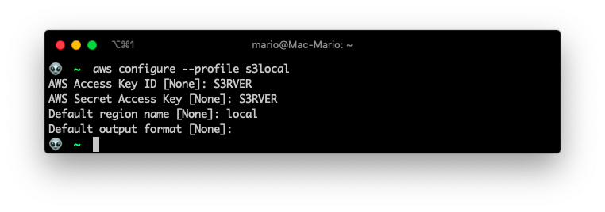

With this command I created the `s3local` profile with key `S3RVER` and secret `S3RVER`. The reason for that specific _Key_ and _Secret_ can be found in the [Serverless S3 Local documentation](https://github.com/ar90n/serverless-s3-local#triggering-aws-events-offline), you'll notice that those are the default key and secret values.

Now, execute `serverless offline start` command... And then create and upload a file:

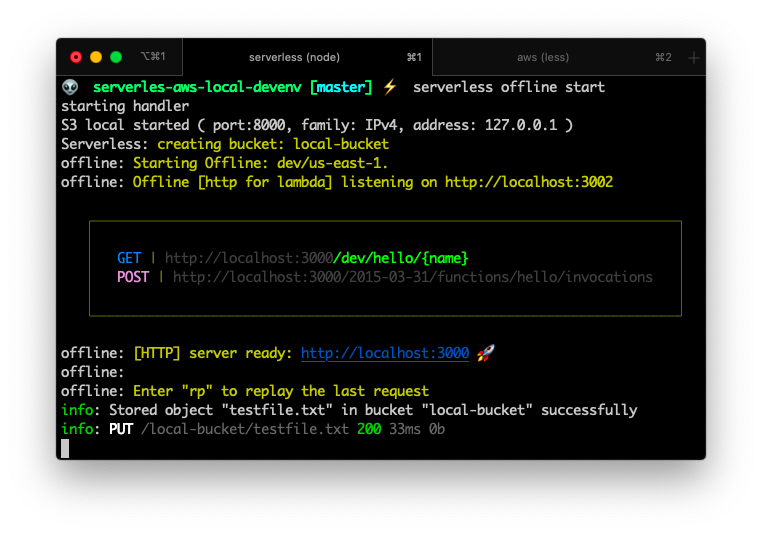

In another terminal execute the `aws s3api put-object` command

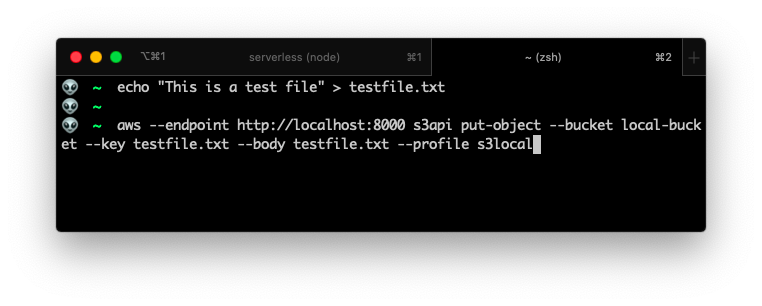

If you look at the end of the first image, you can see that a file was "uploaded".

And if you list the `dist/` folder contents, you can see that there are new files:

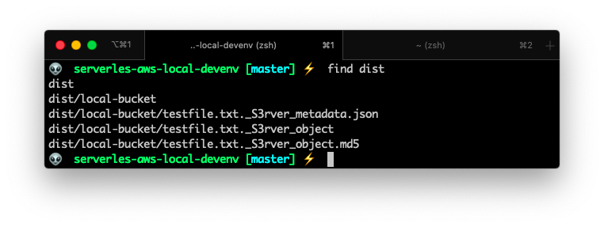

We have a local S3 Bucket!.

## Local DynamoDB

[Dynamo DB](https://aws.amazon.com/dynamodb/) is one of the most used AWS services.

In a few words, DynamoDB is a NoSQL database that handles millions of unstructured records very fast and very efficiently. If you've worked with MongoDB, Casandra, CoutchDB or another NoSQL database, you'll feel right at home here.

To have a local DynamoDB for your serverless development, you need to install the [`serverless-dynamodb-loca`](https://serverless.com/plugins/serverless-dynamodb-local/) plugin AND and a Java Development Kit.

This last part may come as a surprise, but that's the fact. !You need a Java Runtime Engine to have a local DynamoDB database!.

### Install Java

Ok, so. If you don't have it. Install JRE.

You can follow the excellent tutorial on [https://mkyong.com/java/how-to-install-java-on-mac-osx/](https://mkyong.com/java/how-to-install-java-on-mac-osx/). But the gist of it is:

```bash {3}
brew tap adoptopenjdk/openjdk
brew search jdk
brew cask install adoptopenjdk14
/usr/libexec/java_home -V
java -version
```

> The version of the JDK might change, that's why you should execute `brew search jdk` first

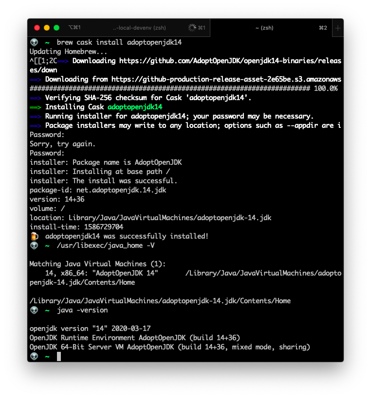

### Install DynamoDB Local plugin

Now that you have a Java Runtime Environment installed, you can go ahead and install `serverless-dynamodb-local` using the good 'ol `npm`.

```bash
npm install serverless-dynamodb-local --save-dev
serverless dynamodb install
echo .dynamodb >> .gitignore
```

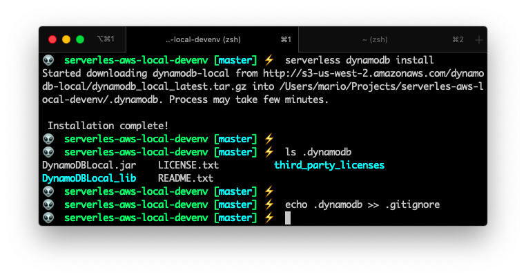

If you noticed, you have to issue the `serverless dynamodb install` command. This creates the local database in your `.dynamodb` sub-dir.

### Configure the resource

The next step is to create a resource in your `serverless.yml` very similarly as we did in the S3 Bucket installation:

```yaml {5,12-24,32-48}
# serverless.yml
. . .
plugins:
  - serverless-s3-local
  - serverless-dynamodb-local
  - serverless-offline # Needs to be the last one

custom:
  s3:
    port: 8000
    directory: ./dist/
  dynamodb:
    stages:
      - dev
    start:
      port: 9000
      inMemory: true
      migrate: true
      seed: true
    seed:
      domain:
        sources:
          - table: UsersTable
            sources: [./seeds/users-table.json]

resources:
  Resources:
    S3Bucket:
      Type: AWS::S3::Bucket
      Properties:
        BucketName: local-bucket
    DynamoDbTable:
      Type: AWS::DynamoDB::Table
      Properties:
        TableName: UsersTable
        AttributeDefinitions:
          - AttributeName: email
            AttributeType: S
        KeySchema:
          - AttributeName: email
            KeyType: HASH
        BillingMode: PAY_PER_REQUEST
```

Let me explain the changes:

- First I added a new plugin called `serverless-dynamodb-local`
- Second, I created the `dynamodb` section in the `custom` variables to configure the database.
- Third, I created a new resource in the `resources` section that specified the name of the **local** DynamoDB table (called `UsersTable`) and the name of the **key field** (in this case is called `email`)

> The DynamoDB Local resource needs the `custom` variables in order to work!

### Create the seeds

To make our life easier, I created a _seeds_ file. This file is a `.json` file that will be use to populate the `UsersTable` with some initial content.

```json
[
  {
    "email": "my-custom-email@gmail.com",
    "names": "Mario Yepes",
    "nationality": "Colombian"
  },
  {
    "email": "another-email@gmail.com",
    "names": "Consuelo Cifuentes",
    "nationality": "Colombian"
  }
]
```

This way, on the next step, we'll have content to review that our configuration works.

### AWS Shell review

Now that we have the DynamoDB resource created and with some initial content, execute `serverless offline start` and head to https://localhost:9000/shell and verify that you have access to the DynamoDB Shell:

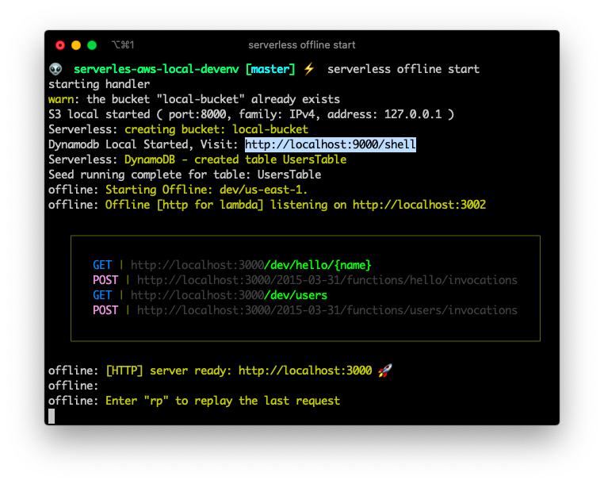

And execute a query in the _DynamoDB Shell_ to verifies that our database was seeded in

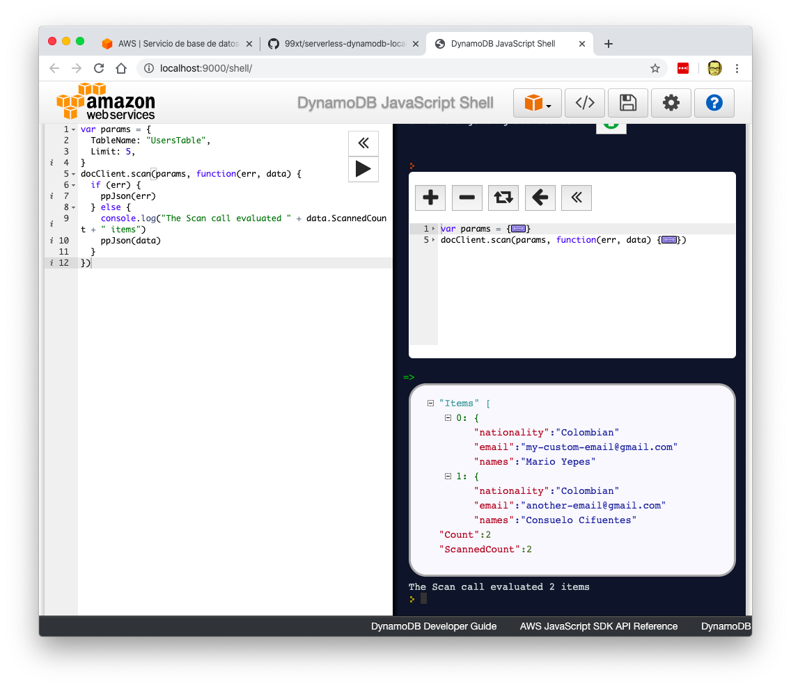

This is the query I used:

```javascript
var params = {
  TableName: "UsersTable",
  Limit: 5,
}

docClient.scan(params, function(err, data) {
  if (err) {
    ppJson(err)
  } else {
    console.log("The Scan call evaluated " + data.ScannedCount + " items")
    ppJson(data)
  }
})
```

### Use the AWS SDK

Now, this is the final DynamoDB step. Lets create a new lambda to verify that we can access this data.

First install the `aw-sdk` by executing the all to familiar `npm install` command:

```bash
npm install aws-sdk --save-dev
```

Then, update the `serverless.yml` adding a new function.

```yaml {10-15}
# serverless.yml
. . .
functions:
  hello:
    handler: lambdas/handler.hello
    events:
      - http: # Double indent the next line!
          method: get
          path: hello/{name}
  users:
    handler: lambdas/users.index
    events:
      - http:
          method: get
          path: users

plugins:
  - serverless-s3-local
  - serverless-dynamodb-local
  - serverless-offline # Needs to be the last one
. . .
```

I called the new function `users` and it points to the function `index` in the file `lambdas/users.js`. So lets create that file with the following content:

```javascript {5-10}
// lambdas/users.js

const AWS = require("aws-sdk")

AWS.config.update({
  region: "local",
  endpoint: "http://localhost:9000",
  accessKeyId: "S3RVER",
  secretAccessKey: "S3RVER",
})
const docClient = new AWS.DynamoDB.DocumentClient()

const response = {
  statusCode: 200,
  body: "",
}

module.exports.index = async event => {
  console.log("Scanning UsersTable in DynamoDB.")
  const params = {
    TableName: "UsersTable",
  }

  try {
    const result = await docClient.scan(params).promise()
    response.statusCode = 200
    response.body = JSON.stringify(result, null, 2)
  } catch (err) {
    response.statusCode = 500
    response.body = JSON.stringify(err, null, 2)
    console.error(err)
  }

  return response
}
```

The important thing in that new file is the _config_ section, where I indicate the `AWS` library to use the configuration of a **local** DynamoDB

```javascript
AWS.config.update({
  region: "local",
  endpoint: "http://localhost:9000",
  accessKeyId: "S3RVER",
  secretAccessKey: "S3RVER",
})
```

On production you should omit (or make conditional 😉) that section and allow _AWS Lambda_ to use the defaults.

Now that the configuration is done, and the file complete, lets issue the `serverless offline start` command to start the DynamoDB database.

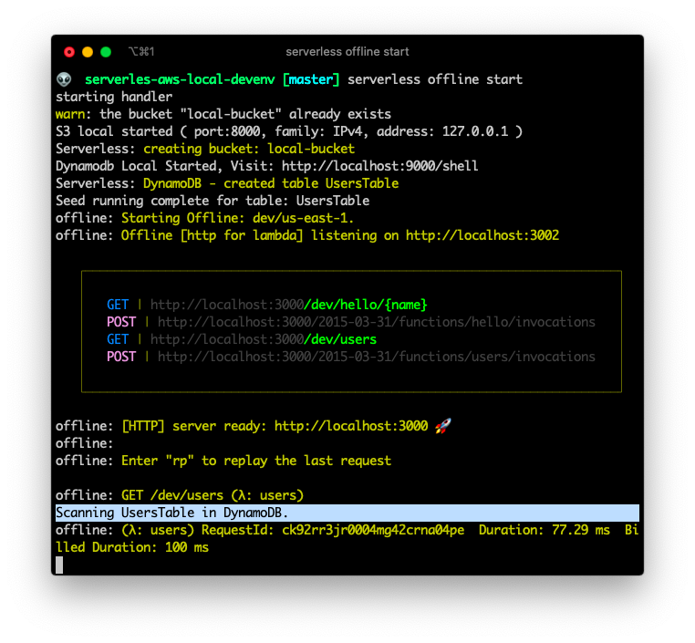

As you can see, there is a new endpoint in `http://localhost:3000/dev/users` (The higlited line is AFTER I make the next request). And if I make a request to that enpoint I receive a valid `json` response:

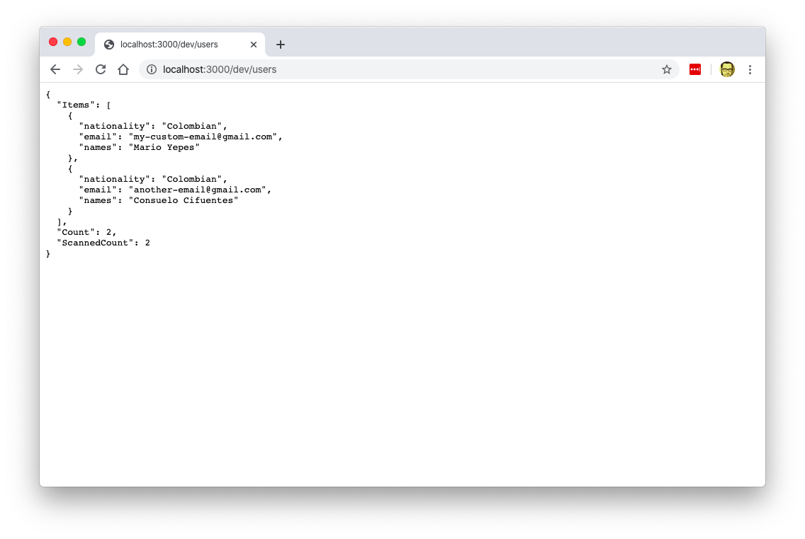

Awesome. We have a working local DynamoDB database with endpoints that actually work.

## Using a local `.env` file for variables

We're almost finished!.

The last step to have a complete local development environment is to have a way to _inject_ environment variables to our functions, since that's the prefered way to configured deployed lambdas in AWS.

For that I need to use the `serverless-dotenv-plugin` package:

```bash
npm install serverless-dotenv-plugin --save-dev
```

And then I have to update the `serverless.yml` file to use some environment variables for things like naming the _DynamoDB Table_ and a custom variable to specify that we're using a local environment:

```yaml {4,14,26}
# serverless.yml
. . .
plugins:
  - serverless-dotenv-plugin
  - serverless-s3-local
  - serverless-dynamodb-local
  - serverless-offline # Needs to be the last one
. . .
custom:
. . .
    seed:
      domain:
        sources:
          - table: ${env:DYNAMODB_TABLE}
            sources: [./seeds/users-table.json]

resources:
  Resources:
    S3Bucket:
      Type: AWS::S3::Bucket
      Properties:
        BucketName: local-bucket
    DynamoDbTable:
      Type: AWS::DynamoDB::Table
      Properties:
        TableName: ${env:DYNAMODB_TABLE}
        AttributeDefinitions:
          - AttributeName: email
            AttributeType: S
. . .
```

Then update the `lambdas/users.js` file make the local configuration conditional:

```javascript
// lambdas/users.js

const AWS = require("aws-sdk");

if (process.env.IS_OFFLINE) {
  AWS.config.update({
    region: "local",
    endpoint: "http://localhost:9000",
    accessKeyId: "S3RVER",
    secretAccessKey: "S3RVER",
  });
}
. . .
```

And to wrap it all up, lets create a `.env` file, with those 2 variables:

```yaml
# DynamoDB Table Name
DYNAMODB_TABLE = UsersTable

# Specify that we're using a local environment
IS_OFFLINE = true
```

If you start your environment again, you can see a section where it shows which environment variables its reading for the `.env` file:

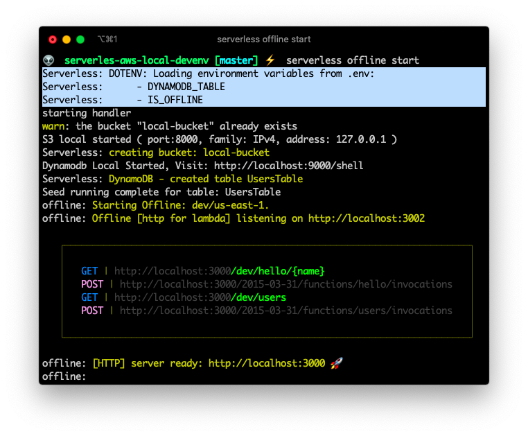

## Deploying to AWS and wrapping up

To deploy the created resources to AWS yo initially have to do 2 things:

- Configure the variables that are on the `.env` file on the Lambda Console
- Select a region for deployment in `serverless.yml`

After that your you can deploy your lambda functions, your Dynamo table and you api endpoints by issuing `serverless deploy`

You can get a copy of the final project in [GitHub](https://github.com/marioy47/serverles-aws-local-devenv) and use it as the starting point of your own project.
