# Simple Mac OS setup for flutter development

So I've been following _The Net Ninja's_ excellent [Flutter tutorial](https://www.youtube.com/playlist?list=PL4cUxeGkcC9jLYyp2Aoh6hcWuxFDX6PBJ), but one thing that he misses is how to install Flutter in your Mac for iOS development. And most of all, how to use the iOS simulator to preview your application in a virtual iPhone.

So I decided to create this short (in words not in length since is loaded with images) article on how to set up your mac for Flutter iOS development in the simplest way possible. I'm also going to go trough Android installation but without too much detail, since most of the steps are going over installation wizards inside [Android Studio](https://developer.android.com/studio).

Before I begin, let me give you a good news and a bad one:

The good news is that all the software we're going to install is free.... The bad one is that all the software is _HUGE_... so most of the time you'll be expending it in downloading apps from the Internet.

## TOC

```toc

```

## Install Xcode

In case you don't know, [Xcode](https://developer.apple.com/xcode/) is the official Apple tool to develop for Mac and iOS.

So, if you want to develop iOS applications you can't get around installing Xcode.

So open the `App Store` app in your mac, search for Xcode, and click on `download`.

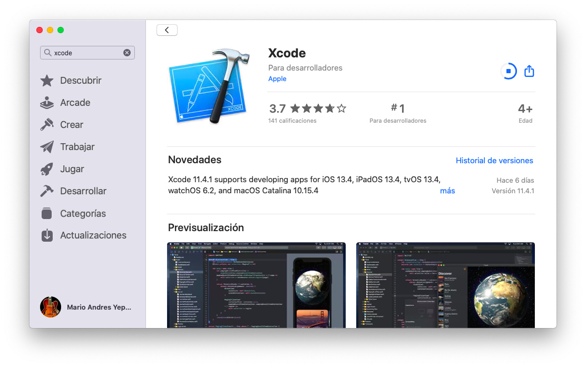

The Xcode is a big download (about 2 Gigs) and a long installation depending on your computer, so in the meantime we can install the `flutter` SDK.

## Install Flutter

The flutter development environment is distributed as source code directly from _github_... which is great since there is no need to download special apps, IDEs, tools, etc.

The added bonus of using git, is that the upgrade process, when new versions of flutter come out, is more straight forward.

But before we do that. **You have to select a place in your hard drive where you want to store the flutter repo**. In my case I selected `~/Projects/flutter/`. This means that the file `~/Projects/flutter/bin/flutter` is going to be **my** main tool to create new flutter projects, run apps inside a simulators and compile apps for distribution.

The steps to install Flutter are then:

- Go to the _parent dir_ where you want to install flutter. (Mine is going to be `~/Projects`).
- Clone the `stable` branch of the git repo
- Add the `$FLUTTER_HOME/bin` to your path `$FLUTTER_HOME` is the dir where the flutter repo got stored, in my case `~/Projects/flutter/`
- Execute `flutter doctor` to make sure everything works

```bash{3}
cd ~/Projects
git clone https://github.com/flutter/flutter.git -b stable
echo 'PATH="$PATH:`pwp`/flutter/bin' >> ~/.zshrc # Or ~/.bachrc
source ~/.zshrc
flutter doctor
```

If you look closely to the shell commands, you can see that I added the directory `~/Projects/flutter/bin` to my `$PATH` by modifying the `~/.zshrc` file (If where using `bash` then it would have been `~/.bashrc`). That's so **I don't have to provide the absolute path to the `flutter` binary every time I need to execute it**. That's why I can execute `flutter doctor` without providing any paths.

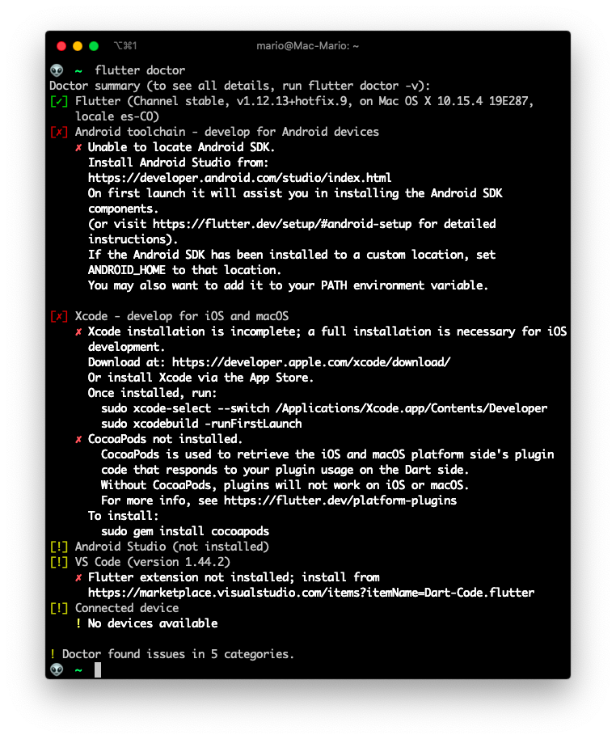

As you an see from the image, the `flutter` commands works, but its giving us some warnings. So lets mover forward with the _Xcode_ installation to make some of them go away.

## Setup Xcode

After Xcode installs, we need to prepare it for development (any type of Mac and iOS development). Se we need to execute the following commands:

```bash
sudo xcode-select --switch /Applications/Xcode.app/Contents/Developer
sudo xcodebuild -license # Space to the en and then "agree"
sudo xcodebuild -runFirstLaunch
```

This commands are just to select the main tools I need for development, to accept the _user's end agreement_ and run _Xcode_ for the first time so it finish its setup.

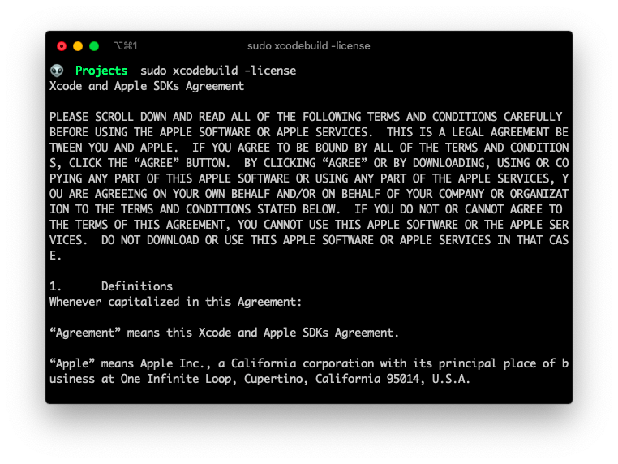

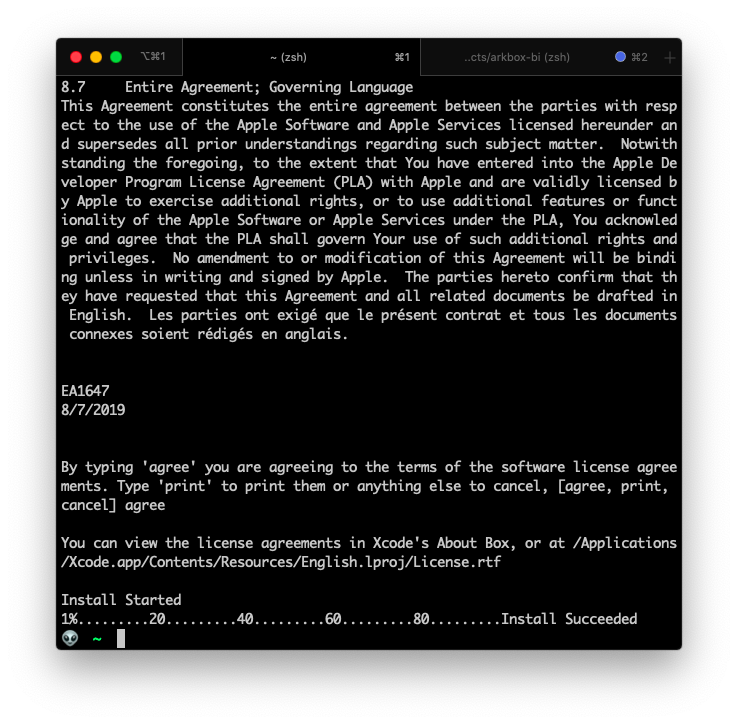

And we're done with Xcode. You don't have to open it again if you don't want to **ever**.

## Create a Flutter test app

To completely verify that _Xcode_ and `flutter` work, we'll create a simple Flutter app, and run it in the iOS simulator that comes with Xcode.

Creating a flutter test app, could't be easier. Just type `flutter create` with the name of an app, and that's it.

```bash
cd ~/Projects # Your pojects folder
flutter create testapp
cd testapp
open -a Simulator
flutter run
```

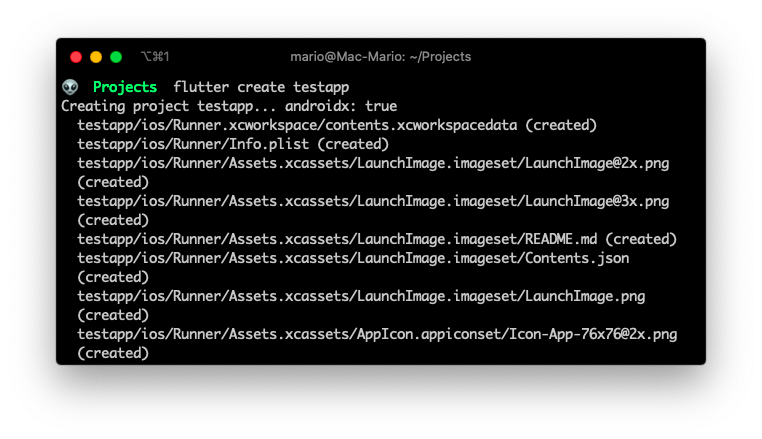

To view your app in the iOS simulator, you **first** need to open the simulator using `open -a Simulator` and the executing `flutter run` so the test app installs itself in the virtual device and then runs inside it.

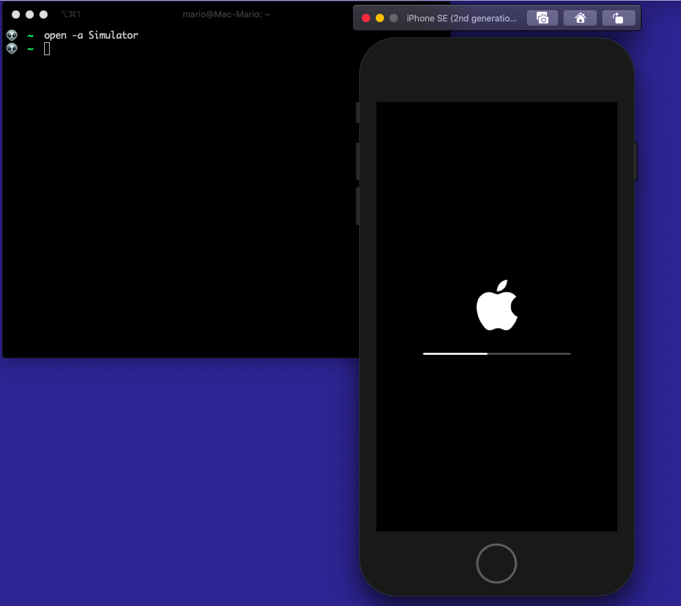

And we have an app inside our simulator...

**You could stop here** if you are just starting or are not interested on developing for Android. But if you are, follow along on how to install Android Studio so you can create Android apps

## Install Android Studio

To develop Android Apps, you need the complete [Android Studio IDE](https://developer.android.com/). And to run Android Studio, you need a **Java Development Kit**.

In my case, I installed JDK 14 since it was the latest at the time of this writing.

```bash
brew tap adoptopenjdk/openjdk
brew search jdk # Look for the latest version
brew cask install adoptopenjdk14
/usr/libexec/java_home -V
java -version
```

And then install _Android Studio_ using `brew` again:

```bash
brew cask install android-studio
open -a "Android Studio"
```

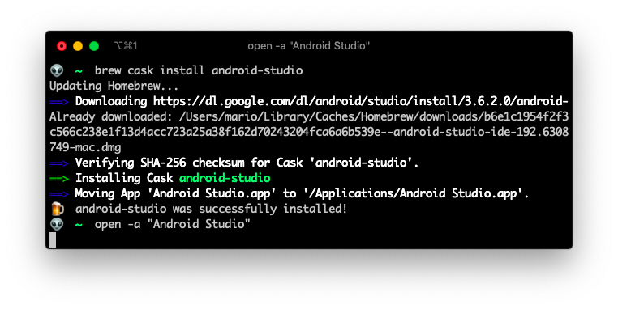

This can take a loooong time, since _Android Studio_ it's even bigger that _Xcode_.

## Configure a Android Virtual Device or AVD

With Android studio installed, you need to create an **AVD** or simulator to test your apps.

This is not as straight forward as with the iOS one, since there are a lot of options when creating your simulator for Android:

- The actual hardware you want to emulate
- Which version of Android to run inside the virtual device
- The dimensions of the device
- The development kit to use for the Android version.

So fire up _Android Studio_ if you haven't already, and in the greetings window, select `Configure > AVD Manager`.

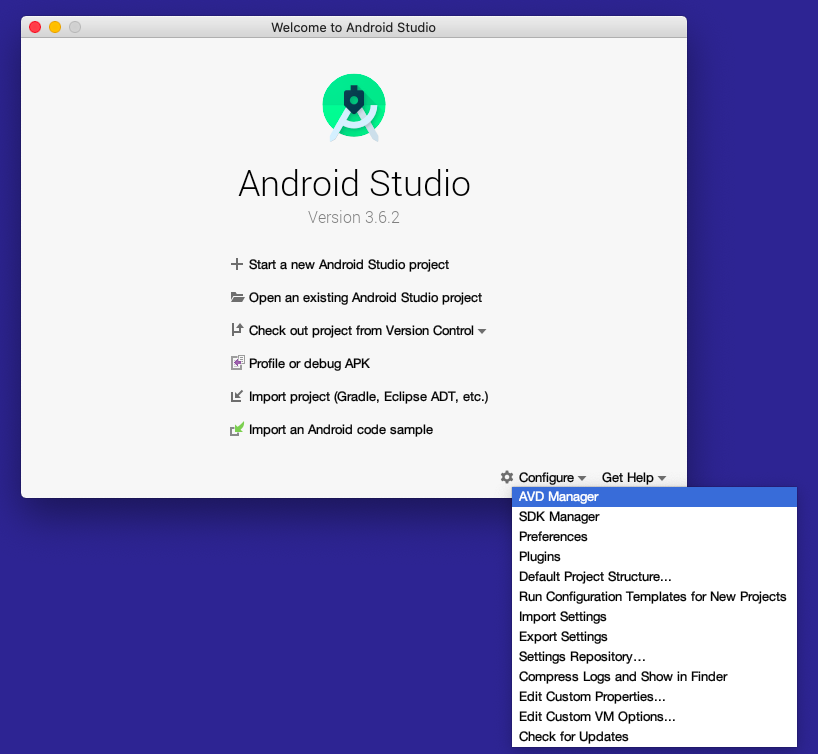

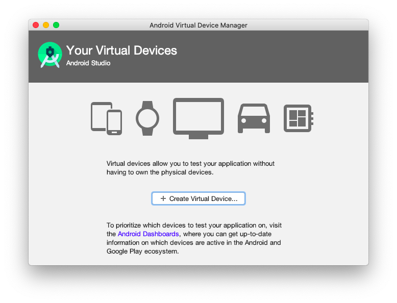

The first question you get, is the **type of hardware** you want to emulate. I selected a **Pixel 2** since it doesn't require a lot of resources from my computer.

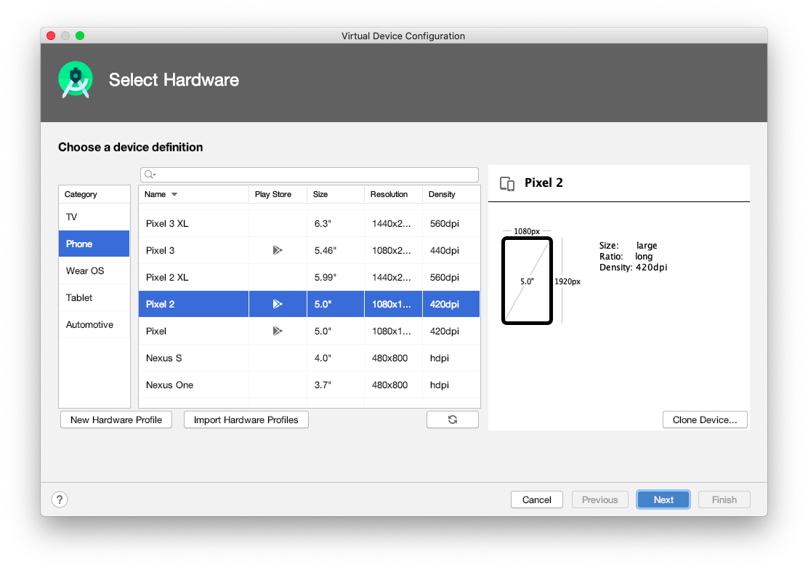

The you have to select the version of Android you want to run in your hardware. I selected **Android Q**.

I didn't select _Android R_ because at the time of this writing it was still on beta and I didn't want any incompatibilities by using unreleased software.

Now click on `Download` and wait again for a big download.

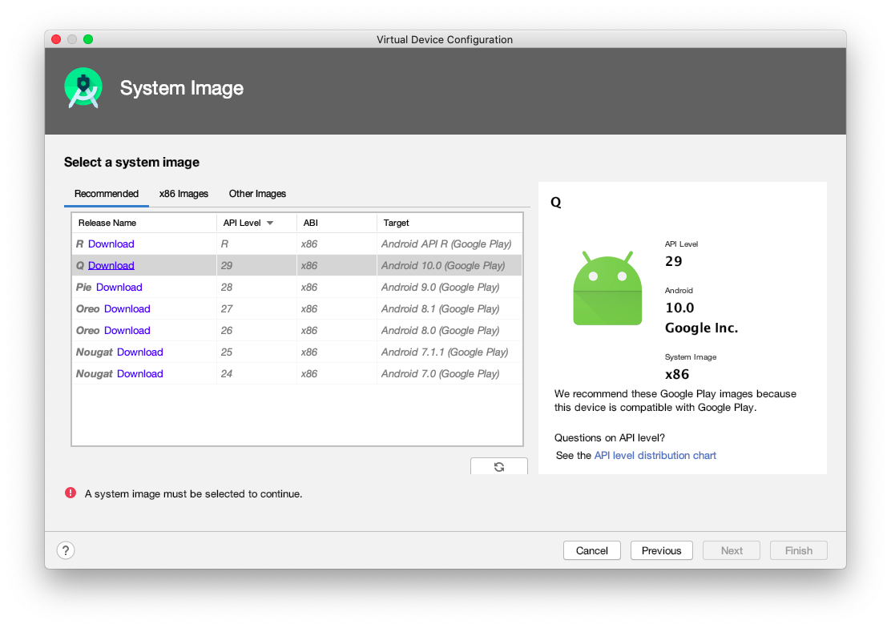

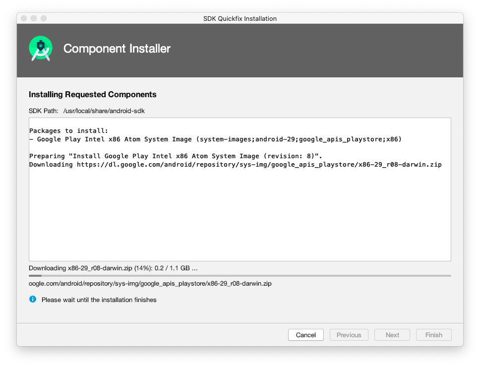

After the installation is finished, you have to name the **newly created device**.

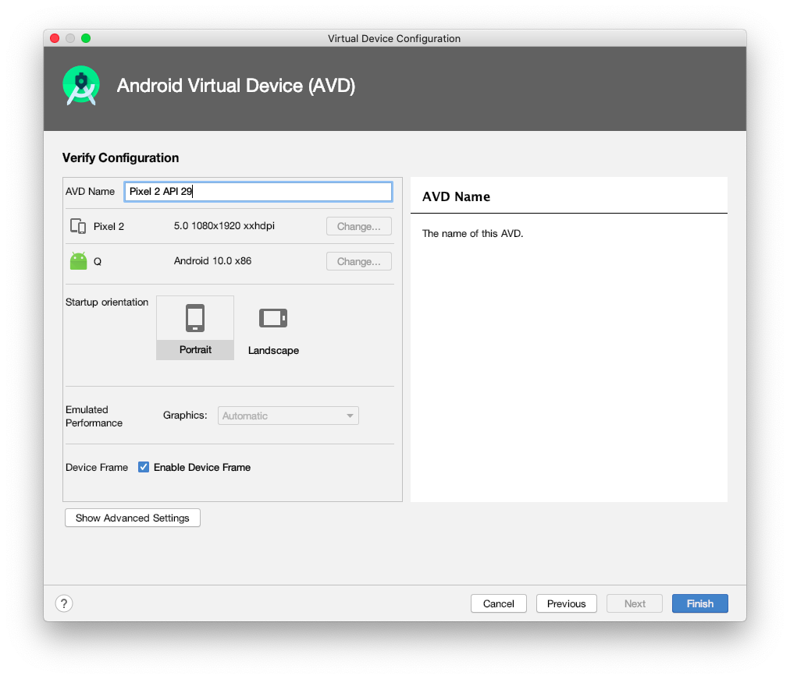

And here it the list of devices in your machine. Right now it only show the one I just created:

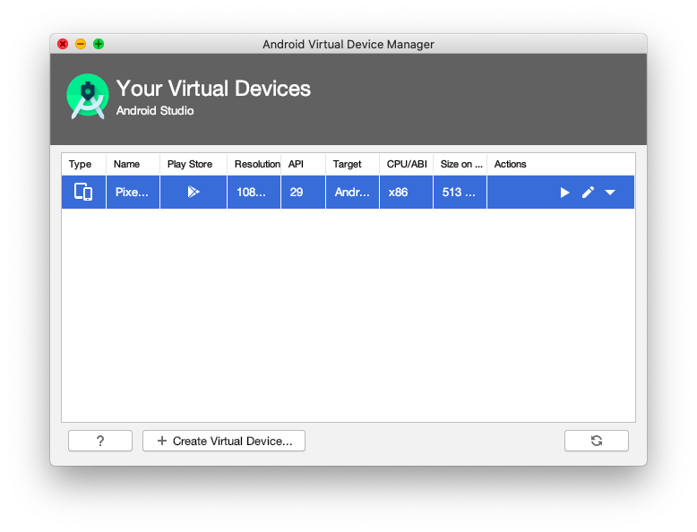

## Install an Android SDK

If I click on the `play` (▶️) icon, in the list of devices (the last image), I'll get a warning about no SDK installed on my machine.

You see, we installed the IDE (Android Studio), a _Virtual Android Device_ (The Pixel 2 with Android Q), but we still have to install the SDK to actually compile apps for Android!!! I told you it was going to be HUGE.

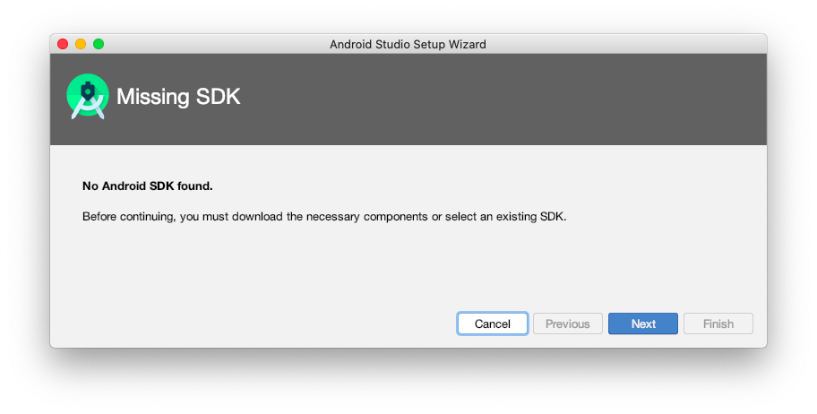

The good news is that this is last piece of software we need to install. And to do it so, just follow along the wizard that Android Studio provides:

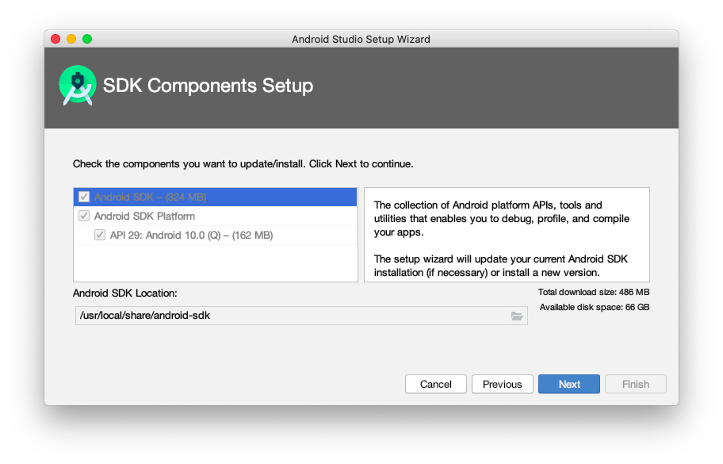

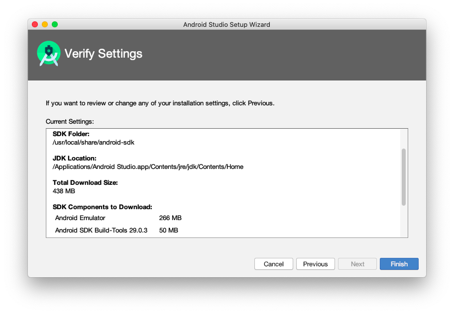

**Now, This is important**: From the this image, you can see that the SDK will be installed in `/usr/local/share/android-sdk`. Yo'll might need this _PATH_ for future steps.

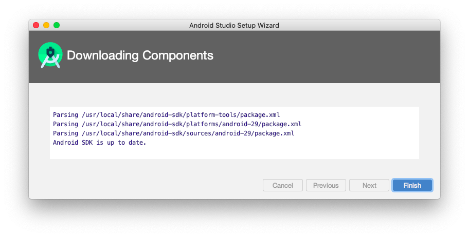

If you are not are going to stick to _Android Studio_ and don't want to use the terminal or _Visual Studio Code_. You can stop reading. **You are completely set up**.

## Setup the Android SDK Path

I knew it... You couldn't stand not knowing how to use _Visual Studio Code_ (or the terminal for that matter) to develop **for Android**.

So let me show you how to run flutter apps from the command line in your _Android Virtual Device_. Which is also necessary if **you re goin to use Visual Studio Code**.

Remember that I told you to take note of the path from "that image" in the previous step? That's the `SDK Path` and we need it to configure it in our `~/.zshrc` (or `~/.bashrc`) so its available for Visual Studio Code and the terminal of course.

```bash
echo "export ANDROID_HOME=/usr/local/share/android-sdk" >> ~/.zshrc # or ~/.bashrc
export ANDROID_HOME=/usr/local/share/android-sdk
flutter doctor
flutter emulators
flutter emulators --launch Pixel_2_API_29
cd ~/Projects/testapp
flutter run
```

That's it, we can now launch the Android emulator from the command line and run flutter apps inside them.

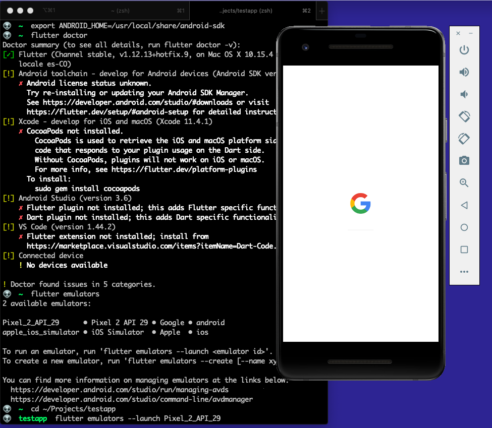

## Visual Studio Code

Finally a couple of tips for _Visual Studio Code_ users like me:

### 1. Install the Flutter extension

If you don't install it, you might as well forget about using _Visual Studio Code_.

You just have to look for _Flutter_ on the extensions panel. Or issue the following command on the terminal:

```bash
code --install-extension Dart-Code.flutter
```

### 2. Some key bindings

As a quick (and personal) reminder, here are the most used key bindings for flutter development:

- `F5` - Open you app in the running simulator in debug mode.
- `Cmd+F5` - Opens your app in the simulator without debug. This makes it run and reload faster.
- `cmd+.` - Activity menu that allows you for instance wrap a widget in another or rename a variable.
- `shift+F5` - Stop debugging.
- `cmd-shift-F5` - Restart Debugging (Hot Reload when debugging Flutter apps).
- `F9` - Toggle Breakpoint.
- `F10` - Step Over.
- `F11` - Step In.
- `Shift+F11` - Step Out.

There are a lot of useful shortcuts that can be [viewed in this excellent blog post](https://medium.com/flutter-community/flutter-visual-studio-code-shortcuts-for-fast-and-efficient-development-7235bc6c3b7d)
