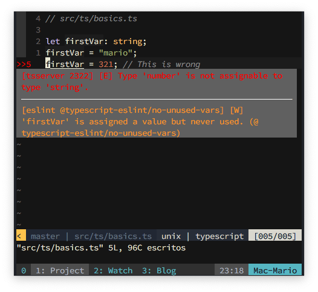
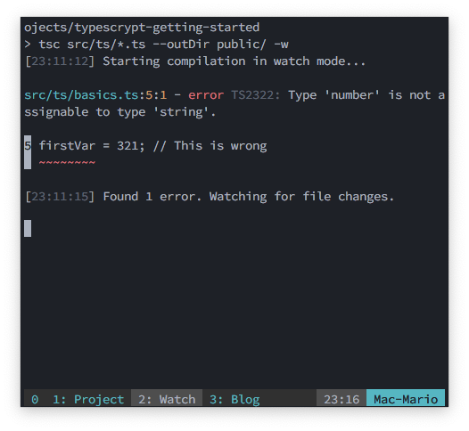
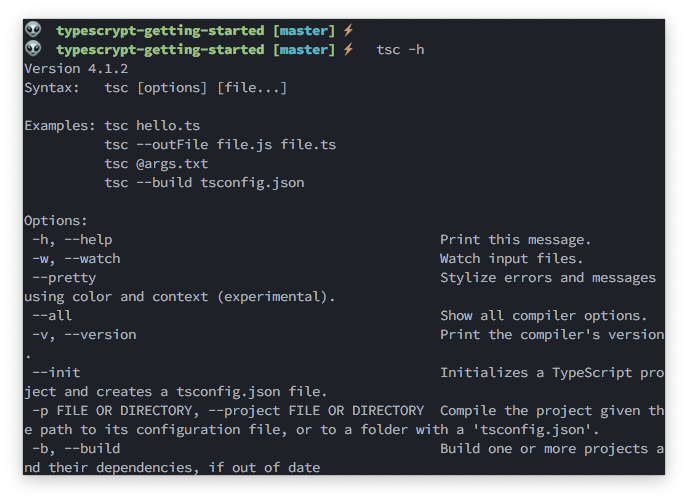
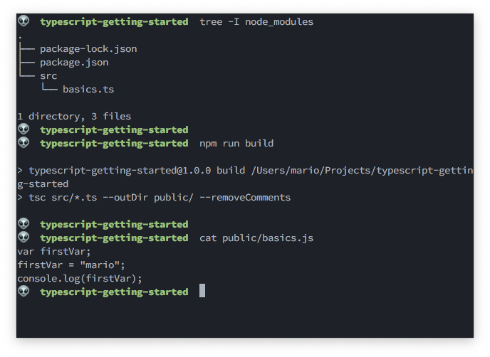

# Typescript Development Setup

TypeScript is all the rage right now... Only by taking a look at the [TypeScript job openings in Stack Overflow](https://stackoverflow.com/jobs/developer-jobs-using-typescript) you can get an idea of how many companies are using it and the demanding for this kind of engineers is right now.

And the reasons are obvious. Its like JavaScript but better... Quite literally I might add:

- It has variable types. And you can even create your own
- You can use Generics
- There is support for Interfaces... Which I loooove
- You have Tuples... For those times when you need a static array
- You get auto-complete and _intellisense_ in your editor for variable name and variable types
- You can catch a lot of bugs at compile type and not at run time
- **Regular JavaScript is valid TypeScript**

One of the advantages of using TypeScript is that you get IDE notices and hits on your code **while** you are just writing it:



Or just get errors at compile time and not at run time:



The best thing is that TypeScript compiles to JavaScript so you can use it in any web page or node project.

If you where place TypeScript in the JavaScript ecosystem, you would get something like this:

<div style="text-align: center">


_Taken from https://basarat.gitbook.io/typescript/recap_

</div>

The cherry on top is that the creator of node, Ryan Dahl, has already crated [Deno](https://deno.land/) which is a _A secure runtime for JavaScript and TypeScript_. Meaning that you can create server side projects using TypeScript without the need of a compiler or transpiler.

If you want a more in depth intro into TypeScript I can not recommend enough the [TypeScript Deep Dive](https://basarat.gitbook.io/typescript/) book by Basarat Ali Syed.

## TOC

```toc

```

## Setup globally

The easies way to setup TypeScript so you can start write projects is by installing the TypeScript's `tsc` compiler globally.

For that you only have to execute `npm` like so:

```bash
npm -g i typescript
```

And just like that you have the `tsc` command available for your computer:



And to convert a Typescript file to JavaScript you just execute `tsc` with the name of the file:

```bash
tsc my-script-file.ts
```

This will create the `my-script-file.js` file right next to the original one.

> Notice how the files have the **`.ts`** suffix.

## Simple setup in a local development environment

Now... I don't really like to install global commands in my computer. And there are 2 reasons for that:

- My _commands namespace_ will get cluttered. This is not so bad since, unless you have millions of commands, the computer doesn't care.
- The _Dev_ (or test) environment gets **less** portable. This is the one that's important for me.

So, if I use global commands, and I want to change my working machine (like to work from home and in the office) I might get errors or incompatibilities.

So, lets create a _dev_ environment that can be more portable and that you can commit to GitHub. This involves 3 steps:

- Install `typescript` and `eslint`
- Create scripts to compile files in `packages.json`
- Test!

I include `eslint` in the first step since I use `vim` and it's one of the best ways to have _linting_.

### Install `typescript` and `eslint`

You really only need the `typescript` package to start compiling, but since I'm using `vim` I also need the `eslint` package and configuration to make sure that I get real time feedback while I'm developing.

This is are the commands right from the project dir creation:

```bash
mkdir typescript-getting-started
cd $_
npm init -y
npm install --save-dev @typescript-eslint/eslint-plugin @typescript-eslint/parser eslint typescript
./node_modules/.bin/eslint --init
```

Let me explain what each of this packages do:

- `typescript` is the TypeScript compiler. That one is kind of obvious
- `eslint` if for formatting and finding errors in the typescript code
- `@typescript-eslint/eslint-plugin` and `@typescript-eslint/parser` are the configuration packages that `eslint`needs to find errors on the project.

So in summary, I installed the TypeScript compiler and the packages required to find those pesky type errors ;).

> If you use Visual Studio Code, you don't need the `eslint` package and the related ones.

### Create scripts to compile files in `packages.json`

Next you need to change the `packages.json` file to add a `build` script that executes the `tsc` compiler for us:

```json {7-8}
{
  "name": "typescrypt-getting-started",
  "version": "1.0.0",
  "description": "",
  "main": "index.js",
  "scripts": {
    "build": "tsc src/*.ts --outDir public/ --removeComments",
    "watch": "tsc src/*.ts --outDir public/ -w"
  },
  "keywords": [],
  "author": "",
  "license": "ISC",
  "devDependencies": {
    "@typescript-eslint/eslint-plugin": "^4.8.1",
    "@typescript-eslint/parser": "^4.8.1",
    "eslint": "^7.14.0",
    "typescript": "^4.0.5"
  }
}
```

This will create 2 commands in your environment:

```bash
npm run build
### and
npm run watch
```

The `npm run build` will find any `.ts` file in the `src/` directory, compile it down to JavaScript and save it in the `public/` directory.

The `npm run watch` will run indefinitely watching any `.ts` file in the `src/` directory. And any changed `.ts` file will be compiled to JavaScript and stored in the `public/` directory in real time.

### Test the setup

The more simple test is to create a `.ts` script with TypeScript syntax:

```typescript
// src/basics.ts

let firstVar: string
firstVar = "mario"
// firstVar = 321; // This is should de marked as wrong in the editor
console.log(firstVar)
```



As you can see at the end of the image. The `tsc` compiler generated not only a `.js` file. But a ES5 compatible JavaScript file. This is obvious by the usage of `var` instead of `let`.

## Using the `tsconfig.json` file

If you need to pass a lot of options to the `tsc` compiler, you can create a `tsconfig.json` file with all the specifications needed by the compiler.

You can bootstrap this file by executing:

```bash
./node_modules/.bin/tsc --init
```

In that file is recommended to make the following changes:

- `target`: `es6`. This tell `tsc` to output `es6` compatible code.
- `rootDir`: `./src/ts` This is telling `tsc` to not create the same folder structure that is in `src/` in `public/` but **any `.ts` file outside `src/` will still be compile**.
- `outDir`: `./public`. This tells `tsc` to ouptut **all files** in `public/`. Even those files that are not in `src/`

To fix the problem that all `.ts` files outsice `src/` get compiled, we need to add the following to `tsconfig.json`

```json {5}
{
  {
    "..."
  },
  "include": ["src"]
}
```

This way we don't need to pass arguments to the `tsc` compiler.

## Some notes about TypeScript vs JavaScript

Without changing the syntax, TypeScript differes from JavaScript in a few parts:

- TypeScript will return error when doing things like adding arrays (`[] + []`) adding objects or adding different types (`{} + 1`).
- The equality is much more strict. For instance `1=="1"` is valid but `false` in JavaScript but not in TypeScript. And `"" == 0` is true in JavaScript.
- In TypeScript `null` is `undefined`, meaning that `null == undefined` is true.
- In general, Typescript doesn't use `null` and is actually part of they're [coding guildelines](https://github.com/Microsoft/TypeScript/wiki/Coding-guidelines#null-and-undefined)

Additonally, all the ES7 syntax and properties are available on TypeScript. And this will continue to be valid for some time: TypeScript will superseed JavaScript.
