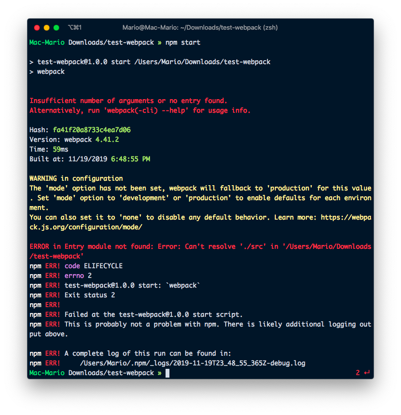
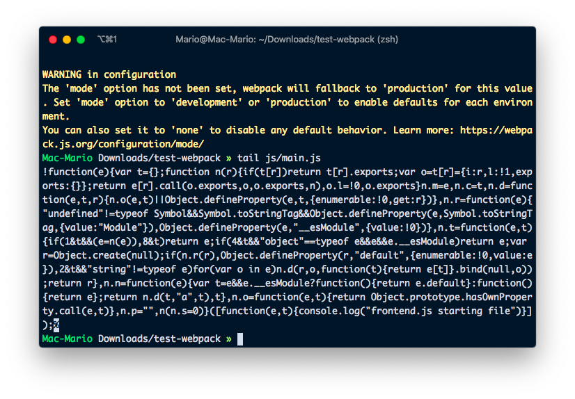
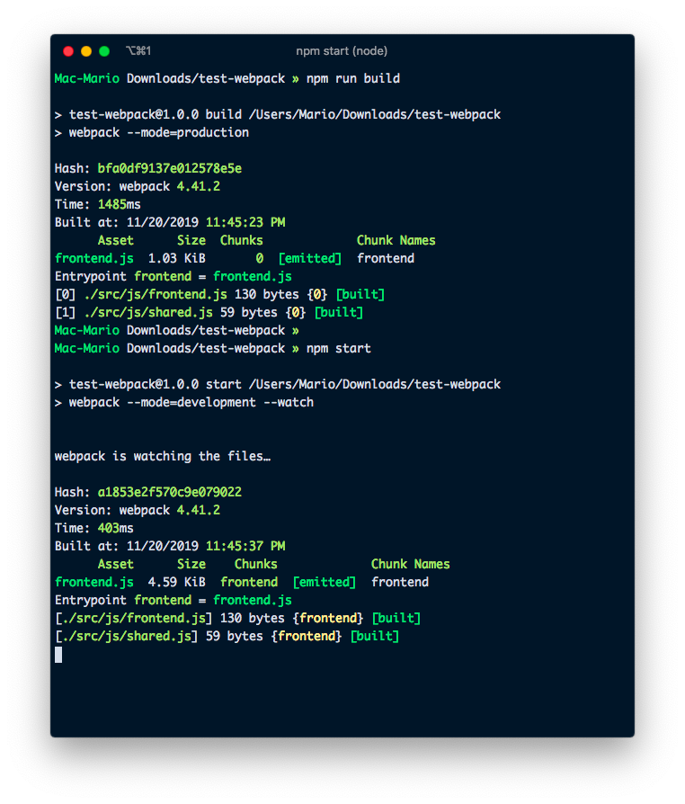
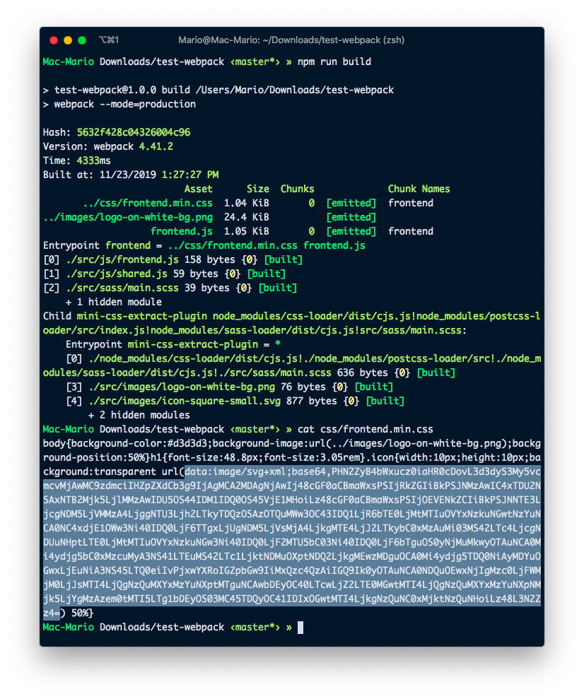

# Using Webpack to compile Javascript in an Wordpress Plugin

So JavaScript is the future of the web, and that's not just me saying, [everybody is saying it](https://www.youtube.com/watch?v=krzx4iy1igu&feature=emb_title).

Just look at Gutenberg, the new editor for WordPress... Is completely written using React which is a JavaScript framework if you didn't knew (how come you didn't knew????).

So if you want to work on WordPress, you need to use JavaScript... And if you want to work in JavaScript, you have to bundle your assets.

## TOC

## ¿What is asset bundling you ask?

Is the process of compiling all of your javascript, css and even images in **just one** javascript file, or bundle, that can be included in your HTML. Or in our case, enqueued in WordPress with `wp_enqueue_script()`.

Some of the advantages of bundling web assets are:

- You'll end up with less files. In some cases just one.
- You can develop your JavaScript using multiple files and let the bundler join them.
- You'll catch errors on build time and not at the deployment since the bundler has to parse the files first before joining them together.
- The overall project will be more manageable.

If you want to know more about [Webpack](https://webpack.js.org/) and asset bundling, head over to the [documentation page](https://webpack.js.org/concepts/) and have a quick read.

Now that I've convinced you that asses bundling is the way to go. Lets set up a WordPress project that uses **webpack** for asset bundling.

## Starting your project.

I'm going to assume you already know how to create WordPress plugins. So I'm not going to go over how to do that. Instead I'm going to show you how to start with Webpack.

So first create a `package.json` file with `npm init -y`. And then add `webpack` to it.

```bash
npm init -y
npm install --save-dev webpack webpack-cli
```

If you executed those commands correctly, you should have a file in your directory called `package.json` similar to the following:

```json
// package.json
{
  "name": "test-webpack",
  "version": "1.0.0",
  "description": "",
  "main": "index.js",
  "scripts": {
    "test": "echo \"Error: no test specified\" && exit 1"
  },
  "keywords": [],
  "author": "",
  "license": "ISC",
  "devDependencies": {
    "webpack": "^4.41.2",
    "webpack-cli": "^3.3.10"
  }
}
```

To make our life easier, I'm going to add the **start** script in that same fie, so I can execute `npm start` and have webpack bundle our scripts.

Lets just edit the _scripts_ section replacing the _test_ script with the following:

```json {8}
// package.json
{
  "name": "test-webpack",
  "version": "1.0.0",
  "description": "",
  "main": "index.js",
  "scripts": {
    "start": "webpack"
  }
  // ...
}
```

And I'll test that to see if it works:



It Doesn't! You didn't thought it was going to be that easy, right?

It doesn't work because we are not using standard conventions and we don't have any files to pack.

## WebPack Configuration

You can instruct webpack which files to bundle and where to put them using a bunch of command line arguments, but they would be to many and to complicated to be a viable solution. Instead we're going to instruct webpack what to bundle, how to bundle it and where to put it by creating the configuration file `webpack.config.js`.

So lets create that file and add our initial configuration:

```js
// webpack.config.js
const path = require("path")

module.exports = {
  entry: "./src/js/frontend.js",
  output: {
    filename: "[name].js",
    path: path.resolve(__dirname, "js"),
  },
}
```

Also, lets create the `src/js/frontend.js` file that we just told `webpack` to look for:

```js
// src/js/frontend.js
const myFunction = () => {
  console.log("frontend.js starting file")
}
myFunction()
```


If you look into `js/main.js` you'll see a javascript file with a bunch of gibberish and at the end the text "_`frontend.js` starting file_".



That means that is working, **we just created our first bundle**.

## Bundling assets

So far we just have created a file (`js/main.js`) with a bunch of content and at the end our original file. That's actually kind of underwhelming.

That's because we haven't done any actual bundling.

To test bundling, create the file `src/js/shared.js` with the following content

```js
// src/js/shared.js
console.log("This is the shared file")
```

And change `src/js/frontend.js` to this:

```js {2}
// src/js/frontend.js
import "./shared"

const myFunction = () => {
  console.log("frontend.js starting file")
}
myFunction()
```

And again, run `npm start` and take a look at the output file (`js/main.js`).


You see the content of both files? Not only that, Do you see that they are joined together in a way that it looks that they where never part of different files? That's bundling baby... Yeah!!! (Austin Powers pun intended).

This is exciting stuff: You can now write your scripts in multiple files and have them be **compiled** (not joined) into one.

## Specify names

Maybe you've noticed, but the output file was named `js/main.js` instead of `js/frontend.js`. That's because we didn't used names on the entry points.

So lets do that. Lest use the name `frontend` as the entry point. Lest edit `webpack.config.js` and change some settings:

```js {5-7}
// webpack.config.js
const path = require("path")

module.exports = {
  entry: {
    frontend: "./src/js/frontend.js",
  },
  output: {
    filename: "[name].js",
    path: path.resolve(__dirname, "js"),
  },
}
```

and execute `npm start` again. You should have a `js/frontend.js` file now with the code of both `src/js/frontend.js` and `src/js/shared.js`.

## Adding babel

Webpack is powerful, very powerful... Webpack uses [loaders](https://webpack.js.org/loaders/) to "preprocess files". In other words, **loaders** allows you to transform your source files even further.

There are loaders for transforming images into _base64_ strings (that you can use in your scripts afterwards), embedding CSS, convert javascript into old format, etc.

In this case, we're going to use the `babel-loader` to convert all the `.js` files written in modern JavaScript into a flavor of JavaScript that is more compatible with older browser, before the bundling happens.

So lets install the `babel-loader` it with:

```bash
npm install --save-dev babel-loader @babel/core @babel/cli @babel/preset-env
```

And change `webpack.config.js` to include a **modules** section. This section will have the loaders that we're going to use and specifications on which files should be passed trough which loaders.

```js {12-23}
// webpack.config.js
const path = require("path")

module.exports = {
  entry: {
    frontend: "./src/js/frontend.js",
  },
  output: {
    filename: "[name].js",
    path: path.resolve(__dirname, "js"),
  },
  module: {
    rules: [
      {
        test: /\.js$/,
        exclude: /node_modules/,
        loader: "babel-loader",
        options: {
          presets: ["@babel/preset-env"],
        },
      },
    ],
  },
}
```

What I'm doing here is:

- Looking for `js` files with the regular expression `/\.js$/`
- Excluding the `node_modles` folder
- Passing those files trough the `babel-loader` so they get converted
- Enjoying 😉

Now the output file, which is `js/frontend.js` will be compiled from ES6 to an version that is more compatible with older browsers.


Look at that! No arrow function but a regular function. We're doing great so far.

## Develop vs Build

¿Aren't you annoyed by the warning?

```
WARNING in configuration
The 'mode' option has not been set, webpack will fallback to 'production' for this value. Set 'mode' option to 'development' or 'production' to enable defaults for each environment.
You can also set it to 'none' to disable any default behavior. Learn more: https://webpack.js.org/configuration/mode/
```

I am.

To get rid of that we have to tell webpack that we are working either with _development_ or _production_ mode. And for that we need to change the _scripts_ in the `package.json` file. Specifically, we need to modify the `start` script to pass the flag `mode` like so.

```json {5,6}
// package.json
{
  // ...
  "scripts": {
    "start": "webpack --mode=development --watch",
    "build": "webpack --mode=production"
  }
  // ...
}
```



Now, when you can execute `npm start` and not have that annoying message. Also, if you look closely, you can see that **development mode takes control of the terminal**. That's because we added the `--watch` flag.

The `--watch` flag tells webpack to keep looking for changes in the `src/js/frontend.js` file (and any file that it requires), and if any changes happen, re-bundle all the project.

¿Isn't that special?... We don't need to keep issuing the `npm start` command all the time. We just now have to change any file, and webpack will compile immediately.

I also created a new script called `build` without the `--watch` flag to be able to compile our files without blocking the terminal.

## SASS

Enough about JS for now. Lets dig into CSS and SASS Bundling. But not only bundling but conversion and generation of CSS from SASS.

As always, it all begins by installing new packages:

```bash
npm install --save-dev node-sass sass-loader css-loader mini-css-extract-plugin
```

We also have to instruct webpack to

- Find `.scss` files (with a new test rule in the _modules_ section).
- Convert them to `css` by **using** the `sass-loader` and `css-loader`.
- And then **extract** the results and save them in the `css/` directory:

That last item is kind of a curveball. It turns out that Webpack bundles **everytihng**!!!. Including CSS files.  So by default your CSS would be included inside your bundle as a _JavaScript_ variable.

That's why we need to tell webpack to extract the CSS and save it elsewhere... Well, if that's what you want that is (Hint: I do want that).

```js {3, 23-35,38-43}
// webpack.config.js
const path = require("path")
const MiniCssExtractPlugin = require("mini-css-extract-plugin")

module.exports = {
  entry: {
    frontend: "./src/js/frontend.js",
  },
  output: {
    filename: "[name].js",
    path: path.resolve(__dirname, "js"),
  },
  module: {
    rules: [
      {
        test: /\.js$/,
        exclude: /node_modules/,
        loader: "babel-loader",
        options: {
          presets: ["@babel/preset-env"],
        },
      },
      {
        test: /\.(sa|sc|c)ss$/,
        use: [
          {
            loader: MiniCssExtractPlugin.loader,
            options: {
              hmr: process.env.NODE_ENV == "development",
            },
          },
          "css-loader",
          "sass-loader", // loading order is inverse
        ],
      },
    ],
  },
  plugins: [
    new MiniCssExtractPlugin({
      filename: "../css/[name].min.css", // Relative to output path.
      chunkFilename: "[id].css",
    }),
  ],
}
```

Let me explain:
- I included the `mini-css-extract-plugin` to extract the CSS from the final bundle.
- I created a new rule that instructs webpack to bundle any imported SCSS or CSS files.
- I instructed the _Extract Plugin_ to save the resulting CSS in `css/`.

To test this new loader, lets make a SASS file in `src/sass/main.scss` with the contents:

```scss
// src/sass/main.scss
$body-bg: lightgray;

body {
  background-color: $body-bg;
}
h1 {
  font-size: 3.05rem;
}
```

And include that file in our `src/js/frontend.js` file. (If you don't include it, it wont get bundled).

```js {3}
// src/js/frontend.js
import "./shared"
import "../sass/main.scss"

const myFunction = () => {
  console.log("frontend.js starting file")
}
myFunction()
```

Again, `npm start` (or `npm run build` if you don't want to block your terminal) and lets look at the result:


As you can see at the end, we now have a `css/frontend.min.css` file.

## PostCSS

Lets push this SASS/CSS compiling a little further. Lets make the resulting CSS have browser prefixes for specific rules, let make the `rem` rules have equivalent in pixel, lets compress the css and import any other css into the resulting file.

For all that we need to use PostCSS plugins:

- https://github.com/postcss/autoprefixer : Add prefix with browser specific rules to the CSS generated rules from SASS.
- https://github.com/robwierzbowski/node-pixrem : Create alternate measurements in pixels to any measurement made in `rems`.
- https://github.com/cssnano/cssnano: Compress the Resulting CSS.
- https://github.com/postcss/postcss-import: Import locally any external css file (like google fonts).

To install the `postcss-loader` and its plugins, we have to execute:

```bash
npm install --save-dev postcss-loader postcss-import pixrem autoprefixer cssnano
```

We also have to add the loader in `webpack.config.js`:

```js {17}
// webpack.config.js
// ...
module.exports = {
  // ...
  module: {
    // ...
    rules: [
      // ...
      {
        test: /\.(sa|sc|c)ss$/,
        use: [
          {
            loader: MiniCssExtractPlugin.loader,
            options: {
              hmr: process.env.NODE_ENV == 'development'
            }
          },
          'css-loader',
          'postcss-loader',
          'sass-loader' // loading order is inverse
        ]
      }
    ]
  },
  plugins: [
    // ...
  ]
}
```

And **very importantly** we have to configure _PostCSS_. Which can be done by creating a `postcss` section in `package.json`.

```json {7-15}
// package.json
{
  // ...
  "devDependencies": {
    // ...
  },
  "postcss": {
    "map": false,
    "plugins": {
      "cssnano": {},
      "autoprefixer": {},
      "pixrem": {},
      "postcss-import": {}
    }
  }
}
```

> You can also use a `postcss.config.js` file. More information on PostCSS configuration [here](https://github.com/postcss/postcss-loader#configuration)

Again, execute `npm run build` and have a look at the resulting `.css` file in `css/frontend.min.css` and look how the `rem` measurements have `px` equivalents.

You can test even further by adding more rules in `src/sass/main.scss` that include transitions and `@imports` and look how they are now converted.

## Using images:

Images? ... Yes, images.

Webpack also packs images. In this project we'll be doing 2 things:

- Compress the images that are in `src/images`
- Embed any small image (less than 8k) used in the `.sass` and `.js` files inside the code as a **base64** encoded string.

So lets start by installing the required modules:

```bash
npm install --save-dev url-loader file-loader image-webpack-loader
```

And just for for testing, lets download [this image](https://raw.githubusercontent.com/webpack/media/master/logo/logo-on-white-bg.png) and [this image](https://raw.githubusercontent.com/webpack/media/master/logo/icon-square-small.svg)

```bash
mkdir -p src/images/
wget https://raw.githubusercontent.com/webpack/media/master/logo/logo-on-white-bg.png
wget https://raw.githubusercontent.com/webpack/media/master/logo/icon-square-small.svg
```

Also, for testing. Let change the `src/sass/main.scss` file:

```scss {5-6,11-15}
// src/sass/main.scss
$body-bg: lightgray;
body {
  background-color: $body-bg;
  background-image: url("../images/logo-on-white-bg.png");
  background-position: center center;
}
h1 {
  font-size: 3.05rem;
}
.icon {
  width: 10px;
  height: 10px;
  background: transparent url("../images/icon-square-small.svg") center center;
}
```

And finally, lets change the `webpack.config.js` file to include those modules.

```js {10-30}
// webpack.config.js
const path = require("path")
const MiniCssExtractPlugin = require("mini-css-extract-plugin")

module.exports = {
  // ...
  module: {
    rules: [
      // ...
      {
        test: /\.(gif|png|jpe?g|svg)$/i,
        use: [
          {
            loader: "url-loader",
            options: {
              limit: 8192, // Files smallers than 8k embed.
              name: "[name].[ext]", // Files bigger than 8k compress.
              outputPath: "../images",
            },
          },
          {
            loader: "image-webpack-loader",
            options: {
              disable: process.env.NODE_ENV == "development",
              mozjpeg: { quality: 50 },
              pngquant: { quality: [0.5, 0.7] },
            },
          },
        ],
      },
    ],
  },
  plugins: [
    // ...
  ],
}
```

The summary of what I did in `webpack.config.init` is to ask small files to be embedded, and big files to be compressed.



Awesome... We have finished our Webpack setup. No the only thing is to convert all this into a WordPress Plugin

## WordPress Plugin

The only thing left to do is to add the files required to make this WordPress plugin and we're done. Specifically we have to copy the `package.json` and `webpack.config.js` in the root of our plugin and we'll be set.

Instead of showing you what that would look like, let me point you to my [WebPack WordPress plugin starter in Github](https://github.com/marioy47/webpack-wordpress-starter) so you can take a look at the whole thing.

... And that's it for this article. Hope you find it useful and you can use it in your projects.
