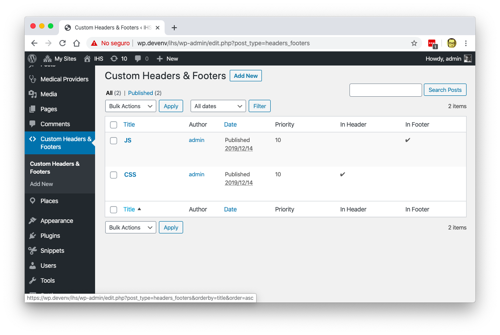
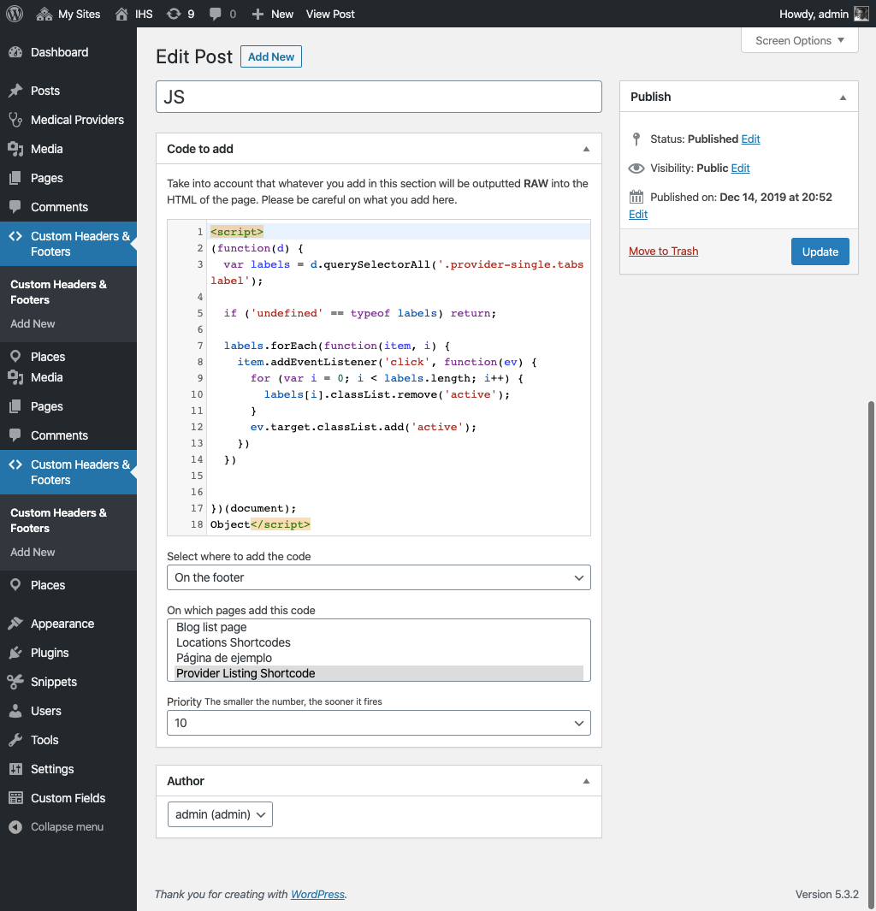
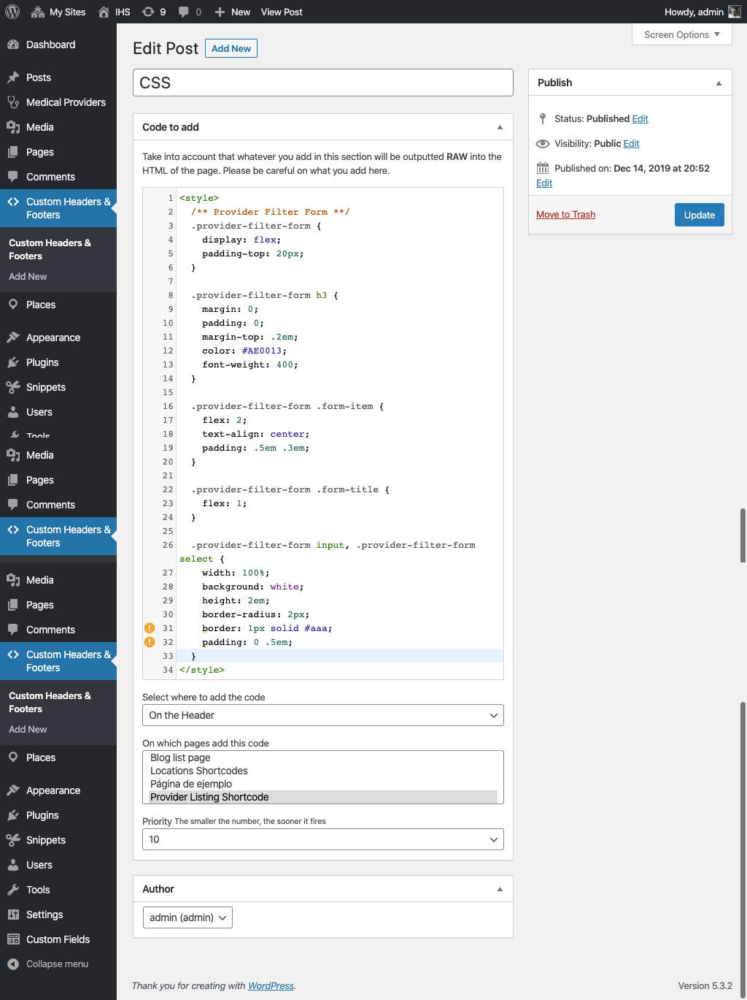

# "Custom Headers & Footers" WordPress Plugin

This plugin was made for the company [iHealthSpot](https://ihealthspot.com) so the marketing team could add any kind of tag on the header or footer of a page.

The main reason to create it as a new plugin instead of using one of the existing ones where:

- There are tags used in Medical Directories in the US that require to add content on both header and footers of a page
- Some of the tags required you to source an external `js` file and add additional JS objects on the content
- The existing plugins allowed you to add content globally and not per page
- The existing plugins did not allow you to set "firing priorities"
- The marketing team wanted _syntax highlight_ when adding code
- The existing plugins had issues with older versions (version < 4.9) of WordPress.
- They needed to keep track of which users made which changes to the code

So this plugin was created to solve those issues, and used an interface that was easier for them to use.

## Screenshots

### Custom Headers & Footers with JavaScript code

### Custom Headers & Footers with CSS code

### Live Codgin
Here is the live coding sessions of the development:

_This is for demonstration purposes only, there is no sound or explanation of the process._

<iframe width="560" height="315" src="https://www.youtube.com/embed/videoseries?list=PLqJrOd2CQU3cpPdSSU8k5V_ZmoRuISCfv" frameborder="0" allow="accelerometer; autoplay; encrypted-media; gyroscope; picture-in-picture" allowfullscreen></iframe>

