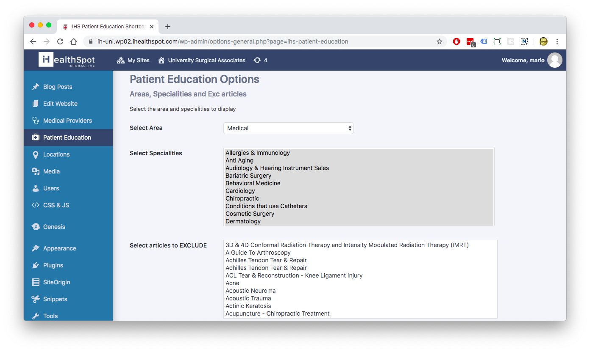
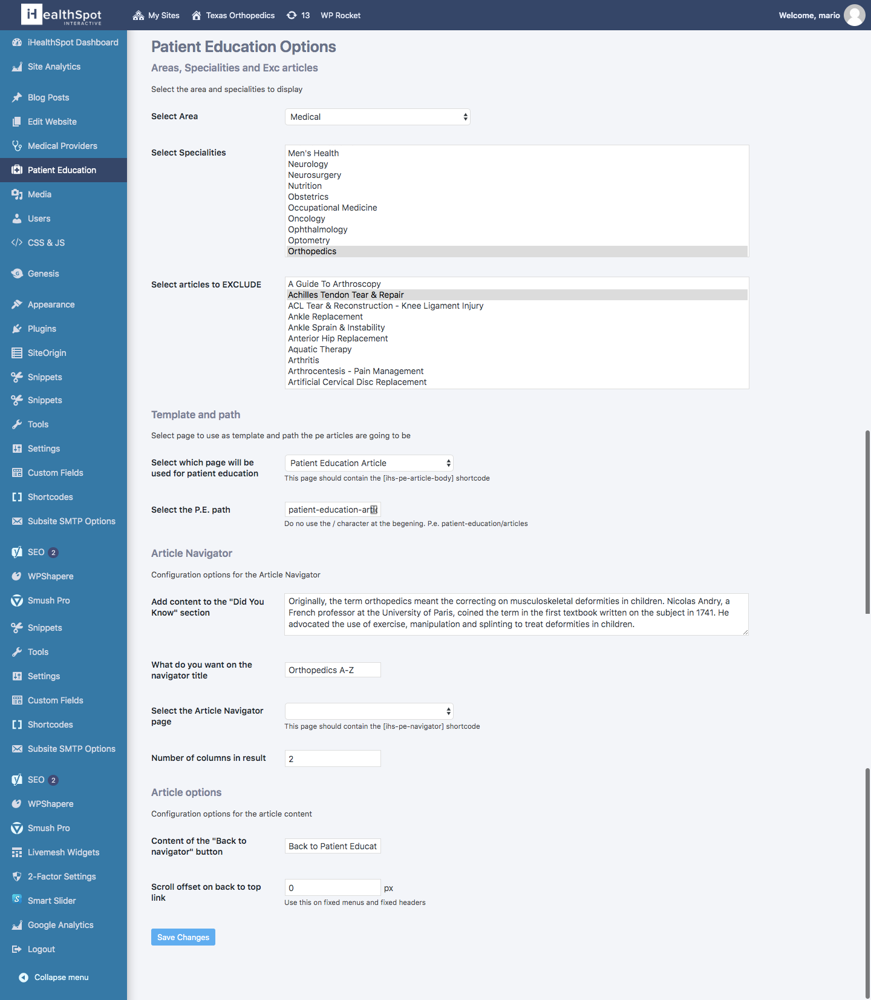
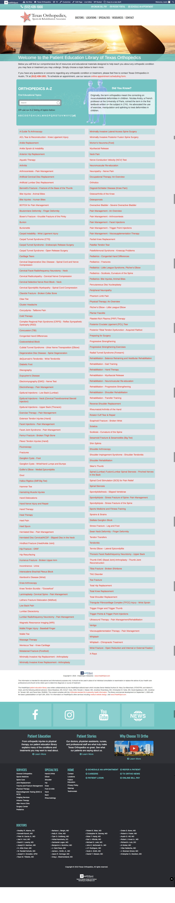

# "Patient Education" WordPress Plugin

This plugin was created for [iHealthSpot](https://ihealthspot.com), which is a Miami based company that offers website design and hosting.

This plugin was made so they could embed their medical database in a WordPress site just by using shortcodes.

