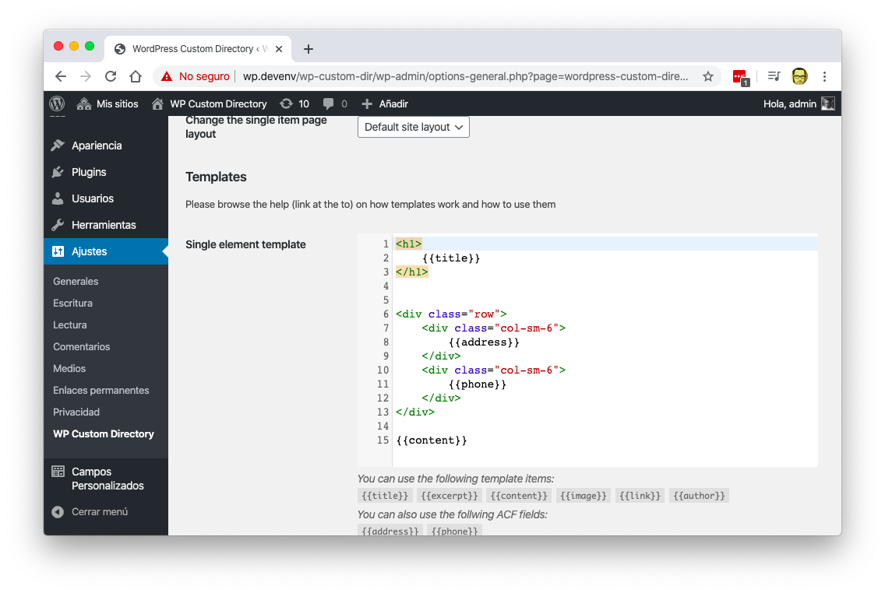
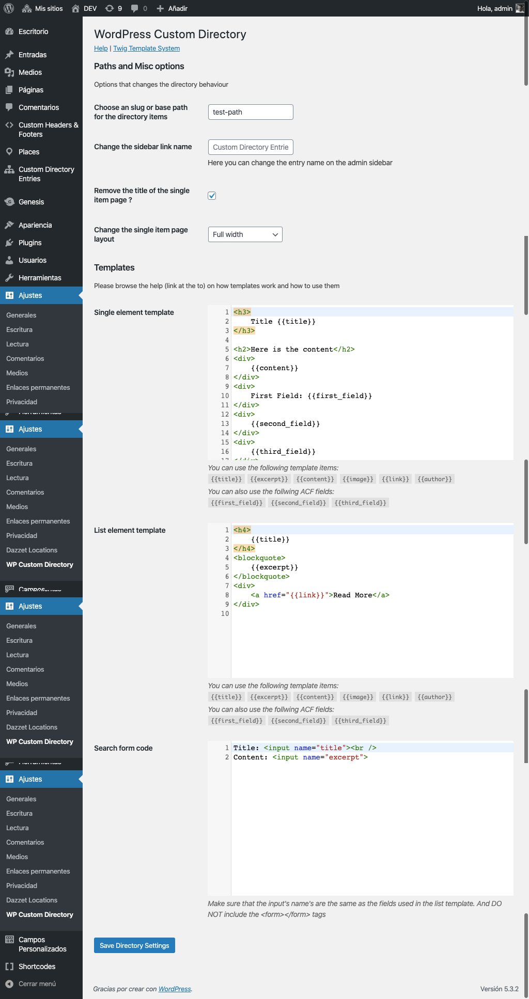
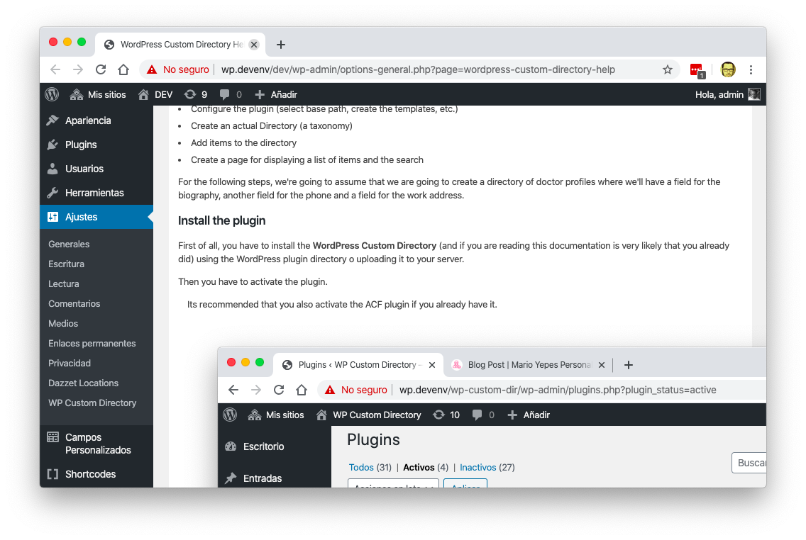
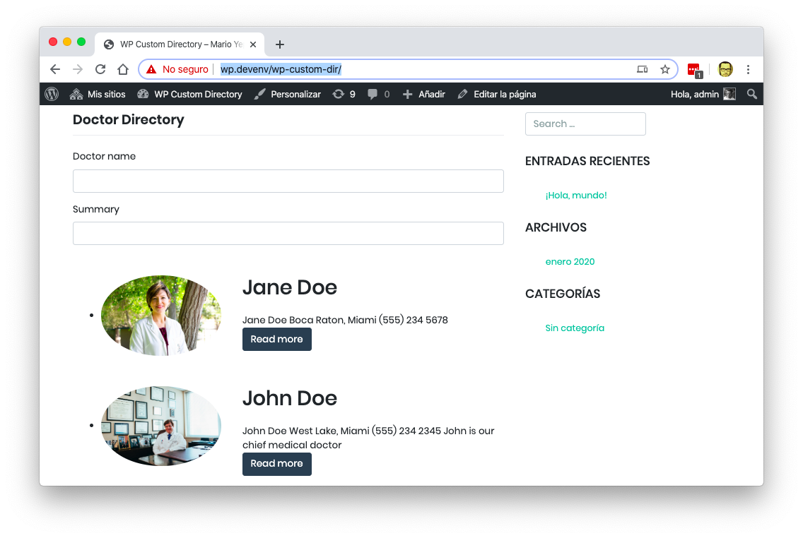

# "Custom Directory" WordPress Plugin

This plugin I did it as a personal project. And the main propose is to allow you create a list of items (like personal profiles, definitions, reference terms, etc.) and have them embedded in any page.

It also allows you to have a live search for the list and support _Advanced Custom Fields_ for additional information.

## Screenshots

### Configuration screen

### Embedded Help

### Directory Sample

## Live coding sessions

Here are the live coding sessions for the creation of the plugin.

_This is for demonstration purposes only, there is no sound or explanation of the process._

<iframe width="560" height="315" src="https://www.youtube.com/embed/videoseries?list=PLqJrOd2CQU3cx-DUq0fPpFyYpLJYkwTba" frameborder="0" allow="accelerometer; autoplay; encrypted-media; gyroscope; picture-in-picture" allowfullscreen></iframe>

